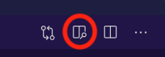

# section

## sous-section

* une liste
* avec des bullets

1. une liste
1. ordonnée avec des
1. numéros

## les fontes

* le **gras**,
* l'*italique*,
* le ***gras italique***,
* on peut ~~même barrer~~ des morceaux

mais surtout pour nous du code `l = string.lower()` comme ceci lorsqu'il est *inline*, ou dans un **bloc** (avec des sauts de ligne) séparé comme cela:

```python
# avec le nom du langage on a des couleurs
# qui mettent en évidence la syntaxe de ce langage
def foo():
    print("Hello World")
```

***

## équations

on peut aussi écrire des maths en $\LaTeX$, soit *inline* comme ceci $\forall x\in\mathbb{R}$, ou encore dans un bloc comme cela:

$$
\forall x \in \mathbb{R}, \forall \epsilon \in \mathbb{R}^+, \exists\alpha\in\mathbb{R}^+ \\
 |x'-x| < \alpha\implies |f(x')-f(x)| < \epsilon
$$

## images

pensez à utiliser l'extension vs-code 'Draw.io Integration' pour produire vos images

### format png (bitmap)



### format svg (vectoriel)


## tables

ça n'est pas forcément supporté dans toutes les variantes de markdown, mais on peut aussi créer des tables simples

| Nom | Prénom | email |
|-:|:-:|:-|
|Dupont|Jean-Daniel|`jean.dupont@example.com`|
|John|Doe|`jd@foo.com`|

## divers

ligne horizontale

---

ou aussi

***
