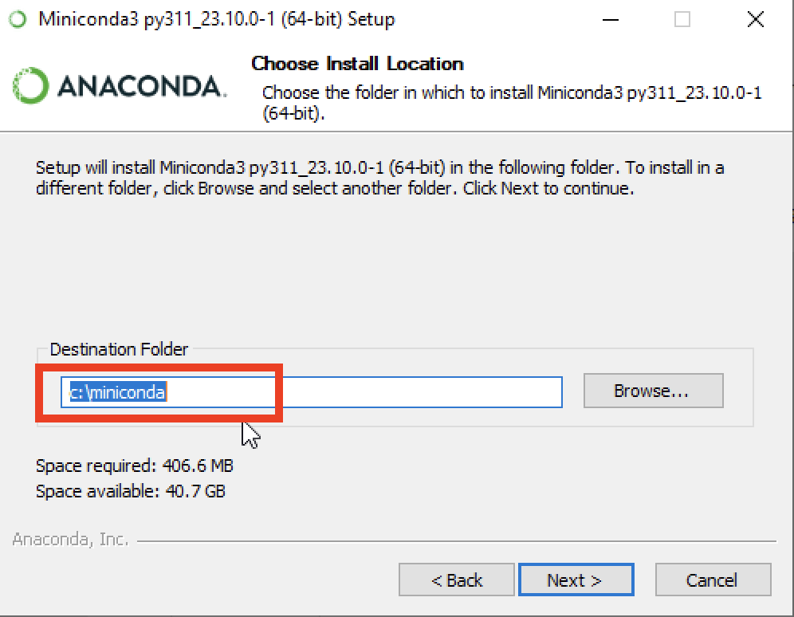

---
jupytext:
  cell_metadata_filter: all,-hidden,-heading_collapsed,-run_control,-trusted
  encoding: '# -*- coding: utf-8 -*-'
  notebook_metadata_filter: all, -jupytext.text_representation.jupytext_version, -jupytext.text_representation.format_version,
    -language_info.version, -language_info.codemirror_mode.version, -language_info.codemirror_mode,
    -language_info.file_extension, -language_info.mimetype, -toc
  text_representation:
    extension: .md
    format_name: myst
kernelspec:
  display_name: Calysto Bash
  language: bash
  name: calysto_bash
language_info:
  help_links:
  - text: MetaKernel Magics
    url: https://metakernel.readthedocs.io/en/latest/source/README.html
  name: bash
nbhosting:
  title: vs-code et Python
---

Licence CC BY-NC-ND, Thierry Parmentelat & Valérie Roy

```{code-cell}
:tags: [raises-exception]

%%python
from IPython.display import HTML
HTML(filename="_static/style.html")
```

# vs-code et Python

## éditeur de code

+++

pour pouvoir facilement modifier le contenu de nos fichiers texte, comme tout à l'heure le
fichier `foo.txt`, on va utiliser un programme qui s'appelle un **éditeur de code**

en effet, il **ne faut pas** utiliser un **outil comme Word** pour éditer des programmes:
c'est un éditeur de texte, et pas un éditeur de code !

> l'enseignant lance Visual Studio Code et le montre très très rapidement

+++

### installation éditeur de code

+++

nous demandons à **tous** les élèves d'installer et de savoir utiliser vs-code

et **ATTENTION** il y a eu **beaucoup de problèmes** les années passé avec les éditeurs de type *pyzo*, ne les utilisez surtout pas dans nos cours, vous allez perdre un temps précieux et en faire perdre à vos enseignants pour des raisons inintéressantes et extérieures à Python

+++

On y va. Le site est là <https://code.visualstudio.com/>. Vous voulez installer donc il va
falloir que vous alliez dans une section *download* ... vous la voyez ? à vous de jouer
maintenant

+++

### micro-démo vs-code

+++

Que vous ayez réussi à installer visual studio code sur votre portable ou pas encore,
suivez maintenant ce que montre l'enseignant.

Si vous avez rencontré des problèmes imprévus lors de l'installation (ce qui n'est pas
rare en informatique), venez nous voir plus tard pour que nous vous aidions.

+++

> micro démo de Visual Code sur le fichier `foo.txt`

* depuis le terminal, aller dans le bon répertoire et lancer
  ```
  code .
  ```

***

* manipulations simples
  * afficher/cacher l'explorateur de fichiers
  * modifier `foo.txt`, sauver la version modifiée
  * créer un nouveau fichier `bar.txt`, le sauver
  * observer le contenu des fichiers depuis le terminal avec `cat`
  * montrer comment se manifeste la fin de ligne

***

* montrer des manipulations élémentaires de fenêtres
  * afficher les deux fichiers côte à côte
  * puis l'un au dessus de l'autre

***

* montrer comment :
  * chercher une extension  (prétexte : l'extension 'Markdown All in One' et/ou Python)
  * installer/désinstaller
  * activer/désactiver une nouvelle extension

***

* montrer comment :
  * passer d'une application à une autre avec `⌥ ⇥` (Alt-Tab)
  * typiquement pour basculer entre vscode et terminal

***

* de retour dans vs-code, montrer la palette :
  * `⇧ ⌘ P` Shift-Command-P (mac)
  * `⇧ ⌃ P` Shift-Control-P (windows)

* sur Windows, pour choisir 'bash' comme terminal
  * utiliser la palette et taper
  * `Select Default Shell`

* montrer comment lancer le terminal
  * Control \` - la deuxième fois on le ferme

+++

pour plus de détails, voir aussi  
<https://code.visualstudio.com/docs/getstarted/userinterface>

+++

exercice :

* refaire les manipulations vous-mêmes une fois l'installation de l'éditeur de code
  terminée.

+++ {"tags": ["level_intermediate"]}

**note**: il est recommandé, avec vs-code, de prendre l'habitude d'ouvrir un **répertoire** plutôt
qu'un fichier

si vous ouvrez un fichier (par exemple par un clic droit sur le fichier dans l'explorateur
de fichiers), vs-code va vous ouvrir le fichier dans une fenêtre déjà ouverte - souvent ça
va arriver comme un cheveu sur la soupe, dans un autre répertoire; si votre objectif c'est
d'ouvrir une nouvelle fenêtre, préfèrez ouvrir tout un dossier

pour cela, vous pouvez soit 

* taper `code .` dans le terminal comme on l'a vu (et ici le `.` correspond au dossier courant)
* ou utiliser le clic droit depuis l'explorateur Windows, mais sur le dossier lui-même et non le fichier

+++

## markdown

+++

c'est un format simple, léger et bien pensé pour mettre en forme facilement vos textes, il
est devenu le couteau suisse pour écrire des documents

* avec un minimum de présentation
  * sections
  * listes
  * gras, italique, code
  * liens
  * maths
* toujours dans un **fichier texte** (à nouveau, ≠ Word)

+++

format **très populaire** en ce moment, supporté e.g. :

* dans les notebooks, justement,
* dans discourse
* dans github
* sur whatsapp (en partie), …

et plus généralement dans tous les sites web de forums/blogs, où on peut entrer du texte
directement depuis le navigateur

+++

### micro-démo sous vs-code

> sous vs-code

* créer un fichier `foo.md`
* remarquer la petite icône 
  * afficher côte à côte le markdown brut et rendu
* rapide survol
  * sections
  * listes avec et sans numérotation
  * gras, italique
* insister sur les plusieurs façons de mettre du code,
  * soit `inline` sans saut de ligne, ou alors
  * avec des "triple ticks" <code>```</code>
  * avec 4 espaces de marge
* images et liens
  * montrer le code markdown de cette cellule notebook

cheatsheet <https://guides.github.com/pdfs/markdown-cheatsheet-online.pdf>

+++

### mathjax

+++

on peut aussi écrire des maths en markdown  
ça se fait en utilisant le langage $\LaTeX$  
c'est un peu abscons au début mais on s'y habitue vite  
parce que c'est vraiment très joli

***

$$
\forall \epsilon \in \mathbb{R}^+, \exists\alpha\in\mathbb{R}^+,
\forall x, |x-x_0| < \alpha\implies |f(x)-f(x_0)| < \epsilon
$$

***

$$
\sum_{i=0}^n i^2 = \frac{(n^2+n)(2n+1)}{6}
$$

+++

#### *inline*

à la base markdown utilise pour ça le signe `$`

si vous voulez mettre des maths dans un paragraphe (on dit *inline*), vous utilisez un
seul `$` au début et à la fin de l'équation; c-a-d si vous écrivez

```latex
voici une petite équation $y = x^2 +2x +1$ au milieu de la ligne
```

vous obtenez

voici une petite équation $y = x^2 +2x +1$ au milieu de la ligne

+++

#### paragraphe séparé

pour mettre une équation dans un paragraphe séparé on double le dollar de début et de fin

du coup

```latex
$$
\forall x \in \mathbb{R}, \forall \epsilon \in \mathbb{R}^+, \exists\alpha\in\mathbb{R}^+ \\
 |x'-x| < \alpha\implies |f(x')-f(x)| < \epsilon
$$
```

se présentera comme ceci :

$$
\forall x \in \mathbb{R}, \forall \epsilon \in \mathbb{R}^+, \exists\alpha\in\mathbb{R}^+ \\
 |x'-x| < \alpha\implies |f(x')-f(x)| < \epsilon
$$

+++

au passage, vous remarquez que les commandes $\LaTeX$  commencent par `\`

+++

#### les mots du jargon $\LaTeX$

+++

ça dépasse complètement notre périmètre que d'essayer de faire le tour de $\LaTeX$; je
préfère commencer par quelques exemples qui devraient vous permettre de démarrer

+++ {"cell_style": "split"}

$$
\forall x\in \mathbb{R},
\; \exists y \leq \epsilon
$$

+++ {"cell_style": "split"}

```
\forall x \in \mathbb{R},
\; \exists y \leq \epsilon
```

+++ {"cell_style": "split"}

$$x_1=\frac{-b+\sqrt{b^2-4ac}}{2a}$$

+++ {"cell_style": "split"}

```
x_1=\frac{-b+\sqrt{b^2-4ac}}{2a}
```

+++ {"cell_style": "split"}

$$
A_{m,n} =
 \begin{pmatrix}
  a_{1,1} & a_{1,2} & \cdots & a_{1,n} \\
  a_{2,1} & a_{2,2} & \cdots & a_{2,n} \\
  \vdots  & \vdots  & \ddots & \vdots  \\
  a_{m,1} & a_{m,2} & \cdots & a_{m,n}
 \end{pmatrix}
$$

+++ {"cell_style": "split"}

```
$$
A_{m,n} =
 \begin{pmatrix}
  a_{1,1} & a_{1,2} & \cdots & a_{1,n} \\
  a_{2,1} & a_{2,2} & \cdots & a_{2,n} \\
  \vdots  & \vdots  & \ddots & \vdots  \\
  a_{m,1} & a_{m,2} & \cdots & a_{m,n}
 \end{pmatrix}
$$
```

+++ {"cell_style": "split"}

$$
\sum_{i=0}^n i^2 = \frac{(n^2+n)(2n+1)}{6}
$$

+++ {"cell_style": "split", "slideshow": {"slide_type": ""}}

```
\sum_{i=0}^n i^2 = \frac{(n^2+n)(2n+1)}{6}
```

+++ {"tags": ["level_intermediate"]}

ceux qui veulent creuser peuvent

* s'exercer avec un outil en ligne <https://www.codecogs.com/latex/eqneditor.php>

* commencer par cet article 
<https://www.physicsoverflow.org/15329/mathjax-basic-tutorial-and-quick-reference>

* approfondir avec celui-ci <https://en.wikibooks.org/wiki/LaTeX/Mathematics>

+++

## Python

+++

### installation de base

* il y a de très nombreuses distributions disponibles
* notre recommandation : miniconda
  * relativement léger
  * permet d'installer en mode "user", c'est-à-dire sans droits administrateur
* (ça va sans le dire mais ne prenez **surtout pas Python 2.7** !)

nous allons

* faire une démonstration de l'installation miniconda sur Windows à partir de
  <https://docs.conda.io/en/latest/miniconda.html> (les linux et les macos le font pour
  leur OS + architectures)

* puis écrire un ou deux programmes Python très simples
* et les exécuter dans un terminal

+++

### préparation : création d'un dossier `c:\miniconda`

+++

une première précaution, spécifique à Windows; il s'agit de contourner un bug dans l'installateur conda, qui se déclenche lorsqu'on choisit un dossier d'installation dans le nom duquel se trouve un caractère accentué ou un espace

+++

du coup, nous allons pour commencer créer un dossier dont le nom est court et simple,
et **qui ne contient pas d'accent** (c'est très important que le chemin complet pour
accéder au dossier où on installe miniconda ne comporte pas d'accents.)

pour cela nous allons lancer la console Windows qui s'appelle `PowerShell`, et créer le
dossier `c:/miniconda`

en deux étapes, ça se présente comme ceci :

+++

(1) pour lancer la console `PowerShell`


+++

(2) on va créer maintenant le dossier dans lequel on installera ensuite miniconda,
et pour cela il y a une seule ligne à taper

```console
md c:/miniconda
```


+++

une fois la commande tapée vous pouvez sortir de PowerShell (utiliser la croix en haut à
droite par exemple)

+++

### installation de miniconda

+++

à ce stade, pour tous les OS, on peut lancer l'installation de miniconda


+++

vous lancez le `.exe`, vous prenez toutes les options par défaut lorsqu'on vous pose une
question, **sauf pour les deux écrans qui suivent**

+++

(1) sur cet écran vous remplacez le chemin qu'on vous propose par défaut, et vous
choisissez à la place le dossier qu'on a créé dans l'étape précédente, c'est-à-dire
`c:\miniconda` (pour les autres OS, vous pouvez prendre sans souci la valeur par défaut pour cette question)



+++

(2) il est important de **bien cocher la case en rouge** (malgré l'avertissement); l'autre est recommandée également


+++

<div class=outline>

en théorie c'est tout ce qu'il y a à faire pour installer conda

toutefois certains élèves nous ont signalé un souci, aussi on vous recommande de lancer à
ce stade dans un terminal

`conda init bash`

</div>

+++

### première utilisation / vérification

+++

juste après l'installation de conda, **quittez vos terminaux actifs**; conda a modifié la
séquence d'initialisation des terminaux bash, il faut donc faire les tests qui suivent
dans un terminal tout neuf.

+++

***
**attention**

* les signes `$ ` ou `>>> ` ne font pas partie de ce que vous devez taper
* c'est juste une indication pour dire
  * avec `$ ` :  que la commande s'adresse au terminal  
  c-à-d à nouveau : GitBash sur Windows, Terminal sur MacOS,  
  et n'importe quel terminal bash sur linux

  * avec `>>> ` : que la commande s'adresse à l'interpréteur Python
***

ça signifie que ce que vous voyez ici correspond à ce qui sera affiché dans le terminal,
mais si vous suivez bien les indications vous n'avez pas à taper le `$` ou les `>>>`, ce
sera déjà affiché lorsque vous taperez vos commandes

+++

#### vérifier que Python est bien installé

```console
$ type python
```

(attention à ne pas coller le `$`, donc)  
qui doit vous répondre quelque chose comme
```
python is /c/Users/Thierry Parmentelat/miniconda3/python
```

si à ce stade vous avez un `python: not found` c'est que vous n'avez pas bien coché la case  
*Add Miniconda3 to my PATH environment variable*; dans ce cas le plus simple est de recommencer l'installation

+++

#### lancer python en mode interactif

depuis `GitBash`, on va lancer un Python interactif et lui faire calculer $2^{100}$,
afficher un texte, puis quitter l'interpréteur.

***

<div class=outline>

<span class="red-pill">quelques limitations connues :</span>

* lancer simplement `python` dans `GitBash` ne fonctionne pas  
  (le programme n'affiche pas le prompt et semble boucler sans rien afficher)

* dans `GitBash` vous **devez** tapez à la place `python -i`  
  (le `-i` est pour *interactive*) pour avoir un interpréteur interactif

* depuis le terminal embarqué dans vscode, vous pouvez faire simplement `python`  
  (`python -i` fonctionne bien aussi d'ailleurs)

* depuis GitBash et le terminal vs-code, vous pouvez lancer normalement `ipython`  
  (dont on parle un peu plus bas)

</div>

***

```console
# pensez à bien mettre le -i - voyez ci-dessus
$ python -i
>>> 2 ** 100
1267650600228229401496703205376
>>> print("hello world")
hello world
>>> exit()
```

+++

#### créer et lancer un premier script

+++

dans le répertoire de votre choix, ouvrez *vs-code* et créez un fichier qui s'appelle
`fact.py` contenant ce texte (n'hésitez pas à copier-coller) :

```{code-cell}
cat ../demo/python/fact.py
```

et dans le même répertoire lancez python pour exécuter ce programme, et donc calculer et afficher le factoriel de deux nombres

```{code-cell}
python ../demo/python/fact.py 10
```

#### afficher le numéro de version de Python

+++

c'est toujours utile d'être bien sûr de la version qu'on a sous la main (surtout avec les
environnments virtuels)

```{code-cell}
python --version
```

### installation de IPython avec `pip`

+++

lorsqu'on installe Python on installe un ensemble minimal de **librairies**  
par exemple dans `fact.py` on a fait `import sys`  
pour pouvoir utiliser la librairie `sys`

+++

c'est très facile d'installer d'autres librairies au delà de cet ensemble minimal  
pour cela python vient avec une commande qui s'appelle `pip`  
qui s'utilise directement **depuis le terminal**

+++

pour avoir la liste des librairies installées on pourrait faire
```bash
pip list
```

+++

#### installer d'autres librairies avec `pip install`

nous allons utliser `pip install` pour installer IPython, et pour ça vous allez taper
(dans un terminal)

```bash
# la première fois qu'on installe une librairie, ça peut prendre
# un petit moment pour aller chercher les packages
# sur Internet et les installer
pip install ipython
```

+++

### micro-démo `ipython`

+++

si vous devez taper du code Python directement dans le terminal, je vous recommande
d'utiliser la commande `ipython` plutôt que l'interpréteur standard `python`

voilà à quoi ça ressemblerait si on devait refaire le calcul de $2^{100}$ comme on l'a
fait plus haut


```console
$ ipython
Python 3.8.3 (default, Jul  2 2020, 11:26:31)
Type 'copyright', 'credits' or 'license' for more information
IPython 7.16.1 -- An enhanced Interactive Python. Type '?' for help.

In [1]: 2 ** 100
Out[1]: 1267650600228229401496703205376

In [2]: print("hello world")
hello world

In [3]: exit()
```

comme vous le voyez c'est presque pareil; simplement avec ipython c'est beaucoup plus
pratique dès qu'on va au delà de ce genre de session de démo, notamment pour

* remonter et modifier l'historique
* obtenir de l'aide en ligne
* utiliser la complétion

+++

### installation de numpy / pandas / matplotlib

+++

le calcul scientifique en Python se fait avec 3 librairies très très communes, sur
lesquelles on reviendra très prochainement

pour l'instant nous allons les installer avec la commande

```console
pip install numpy pandas matplotlib
```

+++

#### vérification

pour vérifier, vous pouvez d'abord, depuis le terminal, faire

    pip show numpy

qui vous montrera en plus le numéro de version de `numpy`

+++

vous pouvez aussi importer la librairie `numpy` depuis `ipython`, ça donne une session qui
ressemble à ceci (vous ne devez pas avoir d'erreur du type `ModuleNotFound`)

```
$ ipython
Python 3.8.3 (default, Jul  2 2020, 11:26:31)
<blabla>

In [1]: import numpy

In [2]: numpy.__version__
Out[2]: '1.19.1'
```

+++

### la complétion

+++

ce qu'on appelle complétion, c'est la capacité d'un outil à vous aider à taper votre code;
exemple :

* on lance `ipython`
* on tape le début d'une commande, par exemple `import frac`
* à ce point, on appuie sur la touche `Tabulation`
* ipython se rend compte que le seul mot qui fait du sens dans ce contexte et qui commence
  par `frac` est `fractions`, du coup il remplit la commande

+++

la complétion est un outil **indispensable** pour ne pas perdre un temps précieux;
apprenez à la maitriser

notez d'ailleurs que **ça existe aussi dans le terminal**, typiquement très utile avec les
noms de fichiers, entre autres

+++

### *RTFEM*

+++

il est normal de faire des erreurs quand on code, tout le monde en fait

on verra un peu plus loin comment les détecter le plus tôt possible (grâce à des
extensions dans un éditeur de code)  
mais les cas où ça se produit quand même, la première chose à faire est bien entendu de
**lire le message d'erreur**

le langage Python s'efforce de vous donner des indications plutôt claires dans ces cas-là

+++

voici par exemple un fichier très proche de `fact.py` qu'on vient de faire tourner  
mais j'y ai intentionnellement glissé une petite erreur de syntaxe  
voici le code, et ce qui se produit si on essaie de le faire tourner

```{code-cell}
:cell_style: split

cat ../demo/python/fact-broken.py
```

```{code-cell}
:cell_style: split

python ../demo/python/fact-broken.py
```

je vous demande en exercice de trouver l'erreur en question

+++

en pratique il arrive qu'on se trouve face à des erreurs plus difficiles à diagnostiquer,
mais dans tous les cas **commencez par *RTFEM***  
ça va de soi mais ça va mieux en le disant, je suis certain qu'on aura l'occasion de le
rappeler pendant les cours de langage :)
