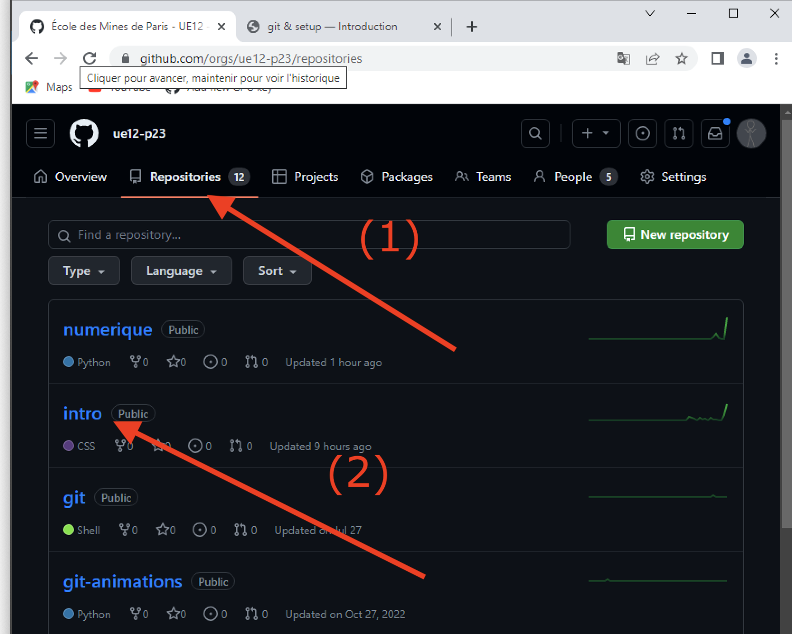
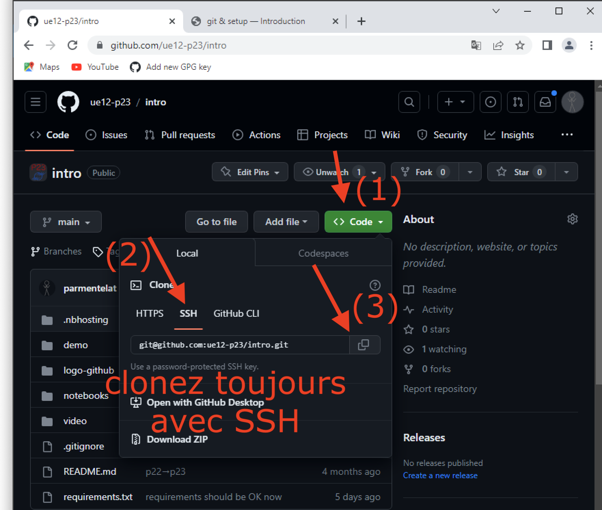

---
jupytext:
  cell_metadata_filter: all,-hidden,-heading_collapsed,-run_control,-trusted
  formats: md:myst
  notebook_metadata_filter: all, -jupytext.text_representation.jupytext_version, -jupytext.text_representation.format_version,
    -language_info.version, -language_info.codemirror_mode.version, -language_info.codemirror_mode,
    -language_info.file_extension, -language_info.mimetype, -toc
  text_representation:
    extension: .md
    format_name: myst
kernelspec:
  display_name: Calysto Bash
  language: bash
  name: calysto_bash
language_info:
  help_links:
  - text: MetaKernel Magics
    url: https://metakernel.readthedocs.io/en/latest/source/README.html
  name: bash
nbhosting:
  title: git & setup
---

Licence CC BY-NC-ND, Thierry Parmentelat & Valérie Roy

```{code-cell}
%%python
from IPython.display import HTML
HTML(filename="_static/style.html")
```

# git & setup

+++

## survol

+++

`git` fait partie des outils dits de "SCM" *source code management*

son rôle est d'aider les développeurs à s'y retrouver dans la gestion des versions d'un
projet

un projet (on dit **un dépôt**), c'est en fait un dossier (et tout son contenu) dont on a conservé un historique des modifications

+++

d'ailleurs ça n'est pas limité aux logiciels :

* jeux de données
* documentation
* lois (très utile pour gérer les modifications)
* …

+++

## à quoi ça sert

+++

### quand on travaille seul

+++

en première approximation, on peut se servir de `git` pour :

* travailler "avec un filet"  
  pour facilement **revenir en arrière** à une version qui marche  
  ça sert donc en particulier de **sauvegarde de luxe**

* lorsqu'on travaille sur plusieurs améliorations en même temps  
  on peut facilement créer **des branches**  
  pour traiter les améliorations séparément  
  avant de tout (re)mettre ensemble (ça s'appelle un *merge*)

+++

### à quoi ça sert - en équipe

+++

on peut aussi :

* **synchroniser** le travail entre groupes / personnes
* dans un sens ou dans l'autre  
  c-a-d: chacun travaille de son coté, et on réconcilie le tout ensuite

git ne fait pas de supposition sur le workflow ou l'organisation,  
on peut l'adapter à tous les cas d'usage (un seule personne, un petit groupe, plusieurs
groupes, open-source, …)

+++

## les notions de base

+++

* un dépôt (en anglais *repo*) :
  * ça ressemble à **un répertoire** avec **tout son contenu**
  * mais ça contient aussi **toutes les versions** successives
* un *commit* :
  * ça correspond à une version particulière du dépôt (de tous les fichiers du dépôt)

et donc un dépôt contient autant de commits que de versions successives

+++

### alice et bob

+++

un exemple de workflow [sous forme de présentation pdf](media/git-workflow-animations.pdf)

(le pdf fait partie du dépôt git,  
dans `media/git-workflow-animations.pdf`)

+++

### compte sous github

+++

Dans la petite présentation alice a choisi `GitHub` pour rendre son travail disponible à
tout le monde en open-source sur Internet.

En effet, `GitHub` est un service web dédié à l'hébergement et à la gestion du
développement de logiciels (open source ou pas). Il utilise le logiciel de gestion de
versions `Git`. Il est actuellement le plus grand hébergeur de code source au monde aussi
c'est celui que nous allons vous demander d'utiliser.

Vous devrez (pas tout de suite) allez sur <https://github.com/join> pour y créez un
compte. Il va naturellement vous falloir un nom d'utilisateur ... attention depuis janvier
2020, il y a plus de 40 millions d'utilisateurs donc il se peut que le nom que vous
vouliez soit déjà pris.

Nous vous demanderons de nous *faire passer* vos identifiants `GitHub` vu que c'est le
moyen que plusieurs UE vont employer pour *relever* vos projets.

Pour prendre des projets dans `GitHub` vous n'avez pas besoin d'un nom d'utilisateur,
c'est pour y mettre des projets que vous en avez besoin.

+++

## digression : URL

+++

lorsque bob copie le travail qu'alice a publié sur github, il va utiliser `git clone` (on
va le faire dans un tout petit moment)

mais il faut évidemment qu'il puisse dire à `git clone` exactement **quoi copier**, parce
que l'Internet, c'est grand…

pour ça il a besoin [d'une URL (Uniform Resource
Locator)](https://en.wikipedia.org/wiki/URL), pour désigner le dépôt d'Alice sur github

c'est quoi une URL ? vous en connaissez déjà plein d'exemples, comme  
http://google.com/  
https://en.wikipedia.org/wiki/URL

* le premier terme (`http` ou `https`) désigne **le protocole** à utiliser pour joindre la
  ressource

* le second morceau (`google.com` ou `en.wikipedia.org`) désigne le *hostname* qu'il faut
  joindre; en fait on utilise un service réseau [qui s'appelle le DNS (Domain Name
  Server](https://en.wikipedia.org/wiki/Domain_Name_System) pour traduire le nom
  `www.google.com` en une adresse réseau (et c'est comme ça qu'en fait deux requêtes
  n'aboutissent pas forcément sur le même serveur, heureusement d'ailleurs)

* la suite est optionnelle et permet de désigner un item particulier à l'intérieur de ce
  serveur; c'est comme ça qu'on peut ranger des milliers de pages à l'intérieur du serveur
  wikipedia

+++

### les URLs sur `github`

+++

à l'intérieur du serveur github, les URLs des dépôts ressemblent toutes à celles-ci

https://github.com/python/cpython  
https://github.com/gvanrossum/cpython

* le premier étage (`python` ou `gvanrossum`) désigne une organisation ou un individu
* le second étage (`cpython`) désigne un dépôt  
  (ici par exemple `cpython` pour l'implémetation classique du langage Python)

+++

## installation

+++

* les Windows : à ce stade, vous avez déjà installé *git for windows*, rien de plus à faire
* les MacOS et linux, utilisez ce lien:  
  <https://git-scm.com/book/fr/v2/D%C3%A9marrage-rapide-Installation-de-Git>

+++

**vérification**

+++

pour vérifier votre installation, vous devez pouvoir taper dans le terminal

```{code-cell}
git --version
```

## setup git

+++

avant de pouvoir utiliser git, il nous faire un minimum de configuration

c'est **très important** de bien **suivre toutes ces consignes**, 
ou alors vous risquez de sérieusement galérer plus tard…

+++

### tout d'un coup

dans votre terminal, entrez les commandes suivantes, en remplaçant évidemment...

```bash
# remplacez ici vos nom et prénom et mail
git config --global user.name "Jean Mineur"
git config --global user.email jean.mineur@mines-paristech.fr

# peut être copié tel quel
git config --global core.editor "code --wait"
git config --global init.defaultbranch main

# enfin par commodité - voir le cours git
git config --global alias.l "log --oneline --graph"
git config --global alias.la "log --oneline --graph --all"
```

pour comprendre pourquoi on fait ça, lisez les sections suivantes:

+++

### votre identité

pour pouvoir créer un commit, git a besoin de savoir votre nom et votre adresse de messagerie

c'est le propos des deux premières commandes ci-dessus, qui définissent `user.name` et `user.email`

+++

### l'éditeur

toujours pour commiter: à chaque commit est associé **un message**  
et git a besoin de savoir **quel éditeur de code** vous voulez utiliser pour entrer ce message

dans notre cas nous allons utiliser **vs-code**, et c'est le propos du réglage qui s'appelle `core.editor`

**remarque**  
lorsque vous faites par exemple `git commit` et que l'éditeur se lance pour vous laisser entrer le message, le programme dans le terminal **attend que vous ayez fini** d'entrer le message  
et pour lui dire "ça y est, j'ai fini, on peut finaliser le commit", ce que vous devez faire, c'est simplement de  
***fermer l'onglet qui édite le message***   
il ne suffit pas de simplement sauver le fichier (c'est nécessaire bien sûr, mais pas suffisant)  
et dans l'autre sens ce n'est pas non plus la peine de terminer toute votre session vs-code (vous pouvez avoir plein d'autres fichiers ouverts à ce moment-là dans vs-code)

**note**  
pour que ça fonctionne, il faut bien sûrœ que la commande `code` soit bien installée dans votre PATH; si vous avez `command not found` quand vous tapez `code .` dans votre terminal, allez dans vs-code, ouvrez la palette et cherchez `Shell Command: Install 'code' command in PATH`

+++

### la branche par défaut

enfin la dernière commande de configuration, celle qui définit `init.defaultbranch`, est là pour que lors de la création d'un repo avec `git init`, on crée une branche qui s'appelle `main` et pas `master` (qui était le défaut il y a quelques années)

+++

## pour tester déjà tout ceci

+++

pour tester tout ceci, procédez comme suit, depuis le terminal (bash bien sûr):

* créez un dossier vierge (souvenez-vous de la commande `mkdir`)
* allez dans ce dossier (avec `cd`) et créez un dépît git
  ```bash
  cd le-dossier
  git init
  ```

* ouvrez l'éditeur de code (avec `code .`)
  ```bash
  code .
  ```
  puis dans vs-code, créez le fichier `readme.md` avec une ou deux lignes de texte, sauvez-le

* de retour dans le terminal, faites
  ```bash
  git add readme.md
  git commit
  ```

* vous devez voir une fenêtre s'ouvrir dans vs-code; allez-y, tapez un message sur la première ligne
  (par exemple `mon premier commit`), puis faites `Control-S` auivi de `Control-W` (ou Command sur mac)

* et là si tout se passe bien: la fenêtre dans vs-code se ferme, et si vous retournez dans le terminal vous voyez que le `git commit` est terminé
* à ce stade faites simplement
  ```bash
  git log
  ```
  et vérifiez:

  * que votre nom et mail est correct
  * et que la branche s'appelle bien `main`

+++

## la clé SSH

depuis Août 2021, il est devenu très compliqué d'utiliser la méthode dite 'HTTPS' pour s'authentifier chez github;
aussi nous allons ensemble voir comment créer une clé pour la méthode SSH

+++

### c'est quoi SSH ?

au départ, c'est un système de terminal distant pour pouvoir administrer les serveurs à distance; l'authentification est basée sur le principe d'une paire de clés publique/privée

sans entrer dans les détails, ces deux morceaux sont en gros deux éléments symétriques l'un de l'autre dans un très gros groupe fini, et on ne peut pas facilement calculer l'un à partir de l'autre  

par définition:

* la clé publique peut être divulguée sans aucun souci au monde entier
* par contre **la clé privée** doit être gardée secrète, donc **jamais exposée/copiée** en dehors de votre ordi

et donc, ce qu'on va faire tout simplement, c'est:

* générer une paire de clés
* et déposer une copie de la clé publique sur github, en l'associant à votre compte github

+++

### création de la paire de clés

pour générer la clé publique vous faites simplement dans le terminal
```bash
ssh-keygen
```

ce programme va vous poser des questions, à ce stade je vous recommande de toujours répondre par simplement la touche *Entrée* pour accepter les défauts et ne pas attacher de mot de passe votre clé privée (ce qui n'est pas une pratique hyper-sûre, mais à ce stade de votre cursus ça parait raisonnable; si vous êtes geek et/ou très soucieux de sécurité, mettez un mot de passe mais soyez prêt à taper votre mot de passe *ad nauseam*, ou à passer du temps à des configurations scabreuses pour ne pas avoir à le faire...)

+++

### affichage de la clé publique

`ssh-keygen` va avoir pour effet de créer deux fichiers situés dans le dossier `~/.ssh` (le tilda signifie: directement sous votre homedir); du coup vous affichez le contenu de la clé publique en faisant maintenant

```bash
cat ~/.ssh/id_rsa.pub
```

et vous copiez tout le contenu (en incluant bien tout, même le `ssh-rsa` et tout)

+++

### attachez la clé à votre compte github

maintenant vous allez sur github  
dans le coin en haut à droite il y a votre icône  
qui ouvre un sous-menu dans lequel vous choisissez *Settings*  
dans la partie gauche de la page qui s'ouvre, cliquez 'SSH and GPG Keys'

+++


+++

et vous ajoutez votre clé publique SSH; mettez ce que vous voulez comme titre, mais vous collez la clé publique dans la zone qui va bien

+++


+++

### pour conclure

à ce stade vous pouvez naviguer jusqu'au cours; pour cela, repartez de l'organisation qui va bien, ici `ue12-p22`, c'est-à–dire ici



puis allez dans le cours (ici `intro`), et copiez l'URL du cours



à partir de maintenant, prenez l'habitude de toujours choisir le mode d'authentification 'SSH' lorsque vous clônez un repo !

+++

## cloner le dépôt du cours

+++

vous avez maintenant tout le bagage pour pouvoir copier le dépôt du cours

il vous suffit pour ça de faire (lisez bien jusqu'au bout avant de copier-coller)

    git clone https://github.com/ue12-p22/intro ue12-p22-intro

**Attention toutefois**

* cette commande va créer sur votre disque tout un dossier (dans le dossier courant), dont le nom est `intro`

* notez qu'il sera créé **dans votre répertoire de travail** (`pwd`)
* donc commencez par **vous mettre au bon endroit**
* le nom `intro` est déduit de la dernière partie de l'URL  
  et si cela ne vous convient pas comme nom, vous pouvez en choisir un autre :

    git clone https://github.com/ue12-p22/intro ue12-p22-intro

+++

pour vérifier que tout s'est bien passé :

    # si vous avez utilisé la deuxième forme
    # votre répertoire local s'appelle ue12-p22-intro et pas juste intro
    cd ue12-p22-intro

    # le répertoire est rempli avec la dernière version du cours
    cat README.md

+++

### si ça échoue

+++

si vous n'arrivez pas à cloner le repo, il y a pas mal de documentation sur github, je vous propose de commencer avec ceci pour vérifier votre setup SSH:

https://docs.github.com/en/authentication/connecting-to-github-with-ssh/testing-your-ssh-connection

+++

## suivre les évolutions

+++

pour terminer cette micro-introduction : imaginez que demain je publie des modifications
dans ce dépôt

alors pour mettre à jour votre dépôt local, il vous suffira de faire

    # toujours dans le même répertoire bien sûr
    git pull

+++

bon en pratique il arrive que ce soit un peu plus compliqué que ça, mais c'est l'idée
générale

on creusera tout ceci dans le cours dédié à git dans quelques semaines

+++ {"tags": ["level_intermediate"]}

## la config, comment ça marche ?

+++ {"tags": ["level_intermediate"]}

pour les curieux, il y a deux niveaux de configuration

1. `local`, limité au repo courant
1. ou `global`, au contraire valable pour tous les repos

il y a une commande `git config` qui permet d'inspecter la configuration  
par défaut on regarde ou change la première famille  
mais avec l'option `--global` on regarde la seconde

+++ {"tags": ["level_intermediate"]}

### lire / vérifier un réglage

+++ {"tags": ["level_intermediate"]}

pour vérifier (lire) la configuration, vous pouvez faire

```bash
# voir toute la config (locale + globale)
git config -l
# du coup pour voir seulement la config globale 
git config -l --global
# ou juste locale
git config -l --local
```

et surtout pour vérifier la valeur d'**un** réglage, par exemple

```bash
git config user.name
```

+++ {"tags": ["level_intermediate"]}

### écrire / changer un réglage

+++ {"tags": ["level_intermediate"]}

eh bien on l'a déjà fait plus haut  
il suffit de décider si on veut ranger le réglage dans la zone locale ou globale  
et se souvenir que la syntaxe c'est `git config param value`

il faut juste comprendre que si vous aviez tapé

```bash
git config --global user.name Jean Mineur  # ne marche pas
```

ça n'aurait pas fonctionné car le shell (bash) ici aurait vu **deux paramètres** différents  
et c'est pourquoi il faut mettre les `"` autour de `Jean Mineur` comme ceci

```
git config --global user.name "Jean Mineur"  # ok maintenant
```

+++ {"tags": ["level_intermediate"]}

### dans quels fichiers

+++ {"tags": ["level_intermediate"]}

enfin si vous êtes vraiment curieux, sachez que les deux familles de config sont rangées dans

* `.gitconfig` - dans votre *home directory* - pour la config globale
* `.git/config` - à la racine du repo - pour la config locale
le dépôt du cours
