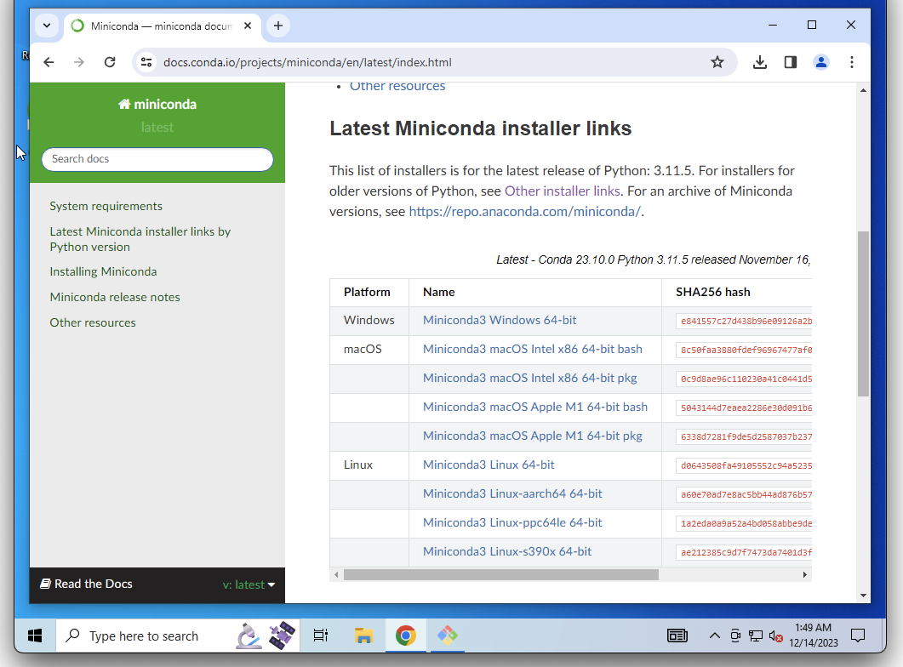

---
jupytext:
  cell_metadata_filter: all,-hidden,-heading_collapsed,-run_control,-trusted
  encoding: '# -*- coding: utf-8 -*-'
  notebook_metadata_filter: all, -jupytext.text_representation.jupytext_version, -jupytext.text_representation.format_version,
    -language_info.version, -language_info.codemirror_mode.version, -language_info.codemirror_mode,
    -language_info.file_extension, -language_info.mimetype, -toc
  text_representation:
    extension: .md
    format_name: myst
kernelspec:
  display_name: Calysto Bash
  language: bash
  name: calysto_bash
language_info:
  help_links:
  - text: MetaKernel Magics
    url: https://metakernel.readthedocs.io/en/latest/source/README.html
  name: bash
nbhosting:
  title: vs-code et Python
---

Licence CC BY-NC-ND, Thierry Parmentelat & Valérie Roy

```{code-cell}
---
editable: true
slideshow:
  slide_type: ''
tags: [raises-exception]
---
%%python
from IPython.display import HTML
HTML(filename="_static/style.html")
```

# Python

+++

## installation de base

* il y a de très nombreuses distributions disponibles
* notre recommandation : miniconda
  * relativement léger
  * permet d'installer en mode "user", c'est-à-dire sans droits administrateur
* (ça va sans le dire mais ne prenez **surtout pas Python 2.7** !)

nous allons

* faire une démonstration de l'installation miniconda sur Windows à partir de
  <https://docs.conda.io/en/latest/miniconda.html> (les linux et les macos le font pour
  leur OS + architectures)

* puis écrire un ou deux programmes Python très simples
* et les exécuter dans un terminal

+++

## préparation : création d'un dossier `c:\miniconda`

+++

une première précaution, spécifique à Windows; il s'agit de contourner un bug dans l'installateur conda, qui se déclenche lorsqu'on choisit un dossier d'installation dans le nom duquel se trouve un caractère accentué ou un espace

+++

du coup, nous allons pour commencer créer un dossier dont le nom est court et simple,
et **qui ne contient pas d'accent** (c'est très important que le chemin complet pour
accéder au dossier où on installe miniconda ne comporte pas d'accents.)

pour cela nous allons lancer la console Windows qui s'appelle `PowerShell`, et créer le
dossier `c:/miniconda`

en deux étapes, ça se présente comme ceci :

+++

(1) pour lancer la console `PowerShell`


+++

(2) on va créer maintenant le dossier dans lequel on installera ensuite miniconda,
et pour cela il y a une seule ligne à taper

```console
md c:/miniconda
```


+++

une fois la commande tapée vous pouvez sortir de PowerShell (utiliser la croix en haut à
droite par exemple)

+++

## installation de miniconda

+++

à ce stade, pour tous les OS, on peut lancer l'installation de miniconda



+++

vous lancez le `.exe`, vous prenez toutes les options par défaut lorsqu'on vous pose une
question, **sauf pour les deux écrans qui suivent**

+++

(1) sur cet écran vous remplacez le chemin qu'on vous propose par défaut, et vous
choisissez à la place le dossier qu'on a créé dans l'étape précédente, c'est-à-dire
`c:\miniconda` (pour les autres OS, vous pouvez prendre sans souci la valeur par défaut pour cette question)


+++

(2) il est important de **bien cocher la case en rouge** (malgré l'avertissement); l'autre est recommandée également


+++

<div class=outline>

en théorie c'est tout ce qu'il y a à faire pour installer conda

toutefois certains élèves nous ont signalé un souci, aussi on vous recommande de lancer à
ce stade dans un terminal

`conda init bash`

</div>

+++

## première utilisation / vérification

+++

juste après l'installation de conda, **quittez vos terminaux actifs**; conda a modifié la
séquence d'initialisation des terminaux bash, il faut donc faire les tests qui suivent
dans un terminal tout neuf.

+++

***
**attention**

* les signes `$ ` ou `>>> ` ne font pas partie de ce que vous devez taper
* c'est juste une indication pour dire
  * avec `$ ` :  que la commande s'adresse au terminal  
  c-à-d à nouveau : GitBash sur Windows, Terminal sur MacOS,  
  et n'importe quel terminal bash sur linux

  * avec `>>> ` : que la commande s'adresse à l'interpréteur Python
***

ça signifie que ce que vous voyez ici correspond à ce qui sera affiché dans le terminal,
mais si vous suivez bien les indications vous n'avez pas à taper le `$` ou les `>>>`, ce
sera déjà affiché lorsque vous taperez vos commandes

+++

### vérifier que Python est bien installé

```console
$ type python
```

(attention à ne pas coller le `$`, donc)  
qui doit vous répondre quelque chose comme
```
python is /c/Users/Thierry Parmentelat/miniconda3/python
```

si à ce stade vous avez un `python: not found` c'est que vous n'avez pas bien coché la case  
*Add Miniconda3 to my PATH environment variable*; dans ce cas le plus simple est de recommencer l'installation

+++

### lancer python en mode interactif

depuis `GitBash`, on va lancer un Python interactif et lui faire calculer $2^{100}$,
afficher un texte, puis quitter l'interpréteur.

***

<div class=outline>

<span class="red-pill">quelques limitations connues :</span>

* lancer simplement `python` dans `GitBash` ne fonctionne pas  
  (le programme n'affiche pas le prompt et semble boucler sans rien afficher)

* dans `GitBash` vous **devez** tapez à la place `python -i`  
  (le `-i` est pour *interactive*) pour avoir un interpréteur interactif

* depuis le terminal embarqué dans vscode, vous pouvez faire simplement `python`  
  (`python -i` fonctionne bien aussi d'ailleurs)

* depuis GitBash et le terminal vs-code, vous pouvez lancer normalement `ipython`  
  (dont on parle un peu plus bas)

</div>

***

```console
pensez à bien mettre le -i - voyez ci-dessus
$ python -i
>>> 2 ** 100
1267650600228229401496703205376
>>> print("hello world")
hello world
>>> exit()
```

+++

### créer et lancer un premier script

+++

dans le répertoire de votre choix, ouvrez *vs-code* et créez un fichier qui s'appelle
`fact.py` contenant ce texte (n'hésitez pas à copier-coller) :

```{code-cell}
cat ../demo/python/fact.py
```

et dans le même répertoire lancez python pour exécuter ce programme, et donc calculer et afficher le factoriel de deux nombres

```{code-cell}
python ../demo/python/fact.py 10
```

### afficher le numéro de version de Python

+++

c'est toujours utile d'être bien sûr de la version qu'on a sous la main (surtout avec les
environnments virtuels)

```{code-cell}
python --version
```

## installation de IPython avec `pip`

+++

lorsqu'on installe Python on installe un ensemble minimal de **librairies**  
par exemple dans `fact.py` on a fait `import sys`  
pour pouvoir utiliser la librairie `sys`

+++

c'est très facile d'installer d'autres librairies au delà de cet ensemble minimal  
pour cela python vient avec une commande qui s'appelle `pip`  
qui s'utilise directement **depuis le terminal**

+++

pour avoir la liste des librairies installées on pourrait faire
```bash
pip list
```

+++

### installer d'autres librairies avec `pip install`

nous allons utliser `pip install` pour installer IPython, et pour ça vous allez taper
(dans un terminal)

```bash
la première fois qu'on installe une librairie, ça peut prendre
# un petit moment pour aller chercher les packages
# sur Internet et les installer
pip install ipython
```

+++

## micro-démo `ipython`

si vous devez taper du code Python directement dans le terminal, je vous recommande
d'utiliser la commande `ipython` plutôt que l'interpréteur standard `python`

voilà à quoi ça ressemblerait si on devait refaire le calcul de $2^{100}$ comme on l'a
fait plus haut


```console
$ ipython
Python 3.8.3 (default, Jul  2 2020, 11:26:31)
Type 'copyright', 'credits' or 'license' for more information
IPython 7.16.1 -- An enhanced Interactive Python. Type '?' for help.

In [1]: 2 ** 100
Out[1]: 1267650600228229401496703205376

In [2]: print("hello world")
hello world

In [3]: exit()
```

comme vous le voyez c'est presque pareil; simplement avec ipython c'est beaucoup plus
pratique dès qu'on va au delà de ce genre de session de démo, notamment pour

* remonter et modifier l'historique
* obtenir de l'aide en ligne
* utiliser la complétion

+++

## installation de numpy / pandas / matplotlib

+++

le calcul scientifique en Python se fait avec 3 librairies très très communes, sur
lesquelles on reviendra très prochainement

pour l'instant nous allons les installer avec la commande

```console
pip install numpy pandas matplotlib
```

+++

### vérification

pour vérifier, vous pouvez d'abord, depuis le terminal, faire

    pip show numpy

qui vous montrera en plus le numéro de version de `numpy`

+++

vous pouvez aussi importer la librairie `numpy` depuis `ipython`, ça donne une session qui
ressemble à ceci (vous ne devez pas avoir d'erreur du type `ModuleNotFound`)

```
$ ipython
Python 3.8.3 (default, Jul  2 2020, 11:26:31)
<blabla>

In [1]: import numpy

In [2]: numpy.__version__
Out[2]: '1.19.1'
```

+++

## la complétion

+++

ce qu'on appelle complétion, c'est la capacité d'un outil à vous aider à taper votre code;
exemple :

* on lance `ipython`
* on tape le début d'une commande, par exemple `import frac`
* à ce point, on appuie sur la touche `Tabulation`
* ipython se rend compte que le seul mot qui fait du sens dans ce contexte et qui commence
  par `frac` est `fractions`, du coup il remplit la commande

+++

la complétion est un outil **indispensable** pour ne pas perdre un temps précieux;
apprenez à la maitriser

notez d'ailleurs que **ça existe aussi dans le terminal**, typiquement très utile avec les
noms de fichiers, entre autres

+++

## *RTFEM*

+++

il est normal de faire des erreurs quand on code, tout le monde en fait

on verra un peu plus loin comment les détecter le plus tôt possible (grâce à des
extensions dans un éditeur de code)  
mais les cas où ça se produit quand même, la première chose à faire est bien entendu de
**lire le message d'erreur**

le langage Python s'efforce de vous donner des indications plutôt claires dans ces cas-là

+++

voici par exemple un fichier très proche de `fact.py` qu'on vient de faire tourner  
mais j'y ai intentionnellement glissé une petite erreur de syntaxe  
voici le code, et ce qui se produit si on essaie de le faire tourner

```{code-cell}
:cell_style: split

cat ../demo/python/fact-broken.py
```

```{code-cell}
:cell_style: split

python ../demo/python/fact-broken.py
```

je vous demande en exercice de trouver l'erreur en question

+++

en pratique il arrive qu'on se trouve face à des erreurs plus difficiles à diagnostiquer,
mais dans tous les cas **commencez par *RTFEM***  
ça va de soi mais ça va mieux en le disant, je suis certain qu'on aura l'occasion de le
rappeler pendant les cours de langage :)

+++

## `autoreload` avec IPython ou les notebooks

**le problème**: vous êtes dans `ipython` ou dans un notebook, et vous faites

```python
from my_module import my_function
my_function(...)
```

et puis ensuite un peu plus tard, vous modifiez `my_module.py` sous vs-code, et vous
voulez essayer la nouvelle version; votre première idée est de refaire l'import pour
recharger le module dans l'interpréteur

là attention, **un second `import` ne recharge pas le fichier** c'est le
comportement attendu, et souhaitable, car charger un module est coûteux; c'est
pourquoi l'interpréteur garde en mémoire les modules qu'il a déjà chargés, et du
coup vous pouvez ré-importer autant que vous voulez, vous allez toujours utiliser
le premier code, et non le nouveau

**la solution**: avec l'astuce suivante, vous n'aurez plus besoin de ré-importer,
vous pourrez juste ré-exécuter `my_function()` et vous utiliserez la dernière
version du module (pour autant que le nouveau module ne contienne pas d'erreur qui
empêche son chargement, bien entendu)

il vous suffit de copier-coller les lignes suivantes dans un terminal bash

```bash
mkdir -p ~/.ipython/profile_default
cat >> ~/.ipython/profile_default/ipython_config.py << EOF
c.InteractiveShellApp.exec_lines = []
c.InteractiveShellApp.exec_lines.append('%load_ext autoreload')
c.InteractiveShellApp.exec_lines.append('%autoreload 2')
EOF
```

````{note} pour les curieux
:class:dropdown

pour ceux qui veulent comprendre, ce script

* commence par s'assurer que le dossier `.ipython/profile_default` existe sous le home directory
* puis dans ce dossier, il ajoute dans le fichier `ipython_config.py` les 3 lignes de configuration qui précèdent le `EOF` (c'est du Python bien sûr)
````
