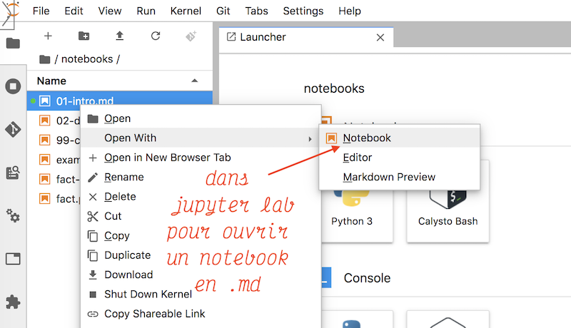
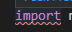
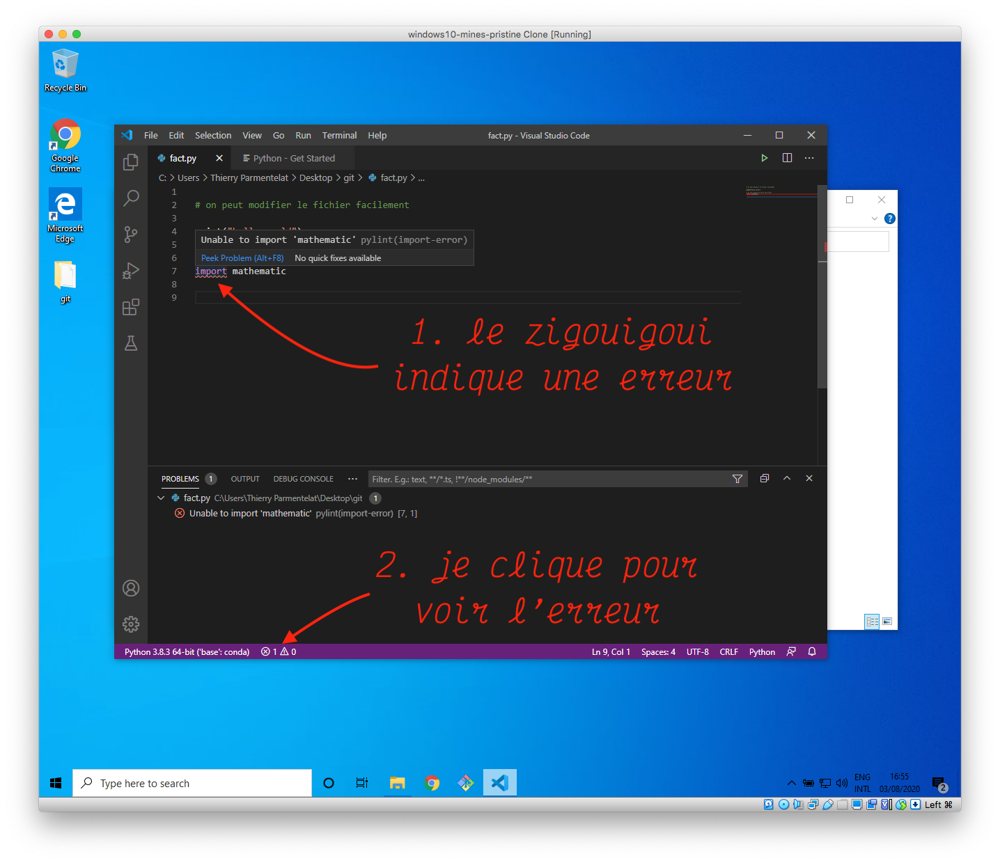

---
jupytext:
  cell_metadata_filter: all,-hidden,-heading_collapsed,-run_control,-trusted
  formats: md:myst
  notebook_metadata_filter: all, -jupytext.text_representation.jupytext_version, -jupytext.text_representation.format_version,
    -language_info.version, -language_info.codemirror_mode.version, -language_info.codemirror_mode,
    -language_info.file_extension, -language_info.mimetype, -toc
  text_representation:
    extension: .md
    format_name: myst
kernelspec:
  display_name: Calysto Bash
  language: bash
  name: calysto_bash
language_info:
  help_links:
  - text: MetaKernel Magics
    url: https://metakernel.readthedocs.io/en/latest/source/README.html
  name: bash
nbhosting:
  title: notebooks en local
---

Licence CC BY-NC-ND, Thierry Parmentelat & Valérie Roy

```{code-cell}
%%python
from IPython.display import HTML
HTML(filename="_static/style.html")
```

# notebooks en local

+++

Les notebooks sont de petits *cahiers* d'exercices exécutables. Ils sont très pratiques
pour expliquer pas à pas ce qu'on fait, comme dans ces cours mais ils ne servent pas
uniquement aux cours.

Nous allons vous montrer dans cette section comment installer et lancer `jupyter`, 
**localement sur votre ordi**, pour créer des notebooks avec des cellules de texte
et des cellules de code...

+++

## installation

+++

le socle s'installe comme ceci (ça peut prendre un moment) :

```console
pip install jupyter
```

+++

je vous invite à installer également ceci; c'est optionnel pour débuter avec Jupyter, mais
ça sera nécessaire très vite pour lire les notebooks du cours

```console
pip install jupytext
```

+++

### vérification

+++

si tout s'est bien passé vous devez pouvoir voir les versions des différents morceaux de
Jupyter comme ceci :

```{code-cell}
jupyter --version
```

## utilisation de base

+++

pour lancer un serveur jupyter vous tapez dans le terminal la commande

```
jupyter notebook
```


+++

ce qui va avoir pour effet d'ouvrir une fenêtre ou un onglet dans votre navigateur Web


+++

## le processus serveur

en fait là on fait deux choses complémentaires

* on lance un programme (le serveur Jupyter) qui tourne dans le terminal
* on demande au browser de créer une page qui interagit avec ce serveur

du coup ça signifie que **le serveur Jupyter doit tourner en permanence**

* si vous le tuez depuis le terminal, le notebook dans le browser va cesser de fonctionner
* ça signifie aussi que cette session du terminal n'est plus utilisable pour autre chose…

+++

## micro-démo Jupyter classic

+++

* un notebook est associé à **un langage**
* nos supports de cours :
  * le plus souvent le langage est **Python**
  * le présent notebook est une exception, son langage est **bash** 
* chaque cellule est *typée* comme **markdown** ou **code**
* et bien sûr celles typées **code** sont exécutées par … le langage du notebook

+++ {"tags": ["level_intermediate"]}

(il est possible aussi de mélanger plusieurs langages dans un notebook, mais c'est d'un
usage plus complexe)

+++

pour créer un nouveau notebook


+++

pour renommer le notebook menu  *File* → *Rename*


+++

comme toujours il faut sauver son travail régulièrement;  
remarquez dans le terminal où vous avez lancé le serveur, un message de confirmation


+++

choisir le type de la cellule; on peut aussi faire

* `Control-M M` pour markdown
* `Control-M Y` pour code (y comme pYthon)


il y a aussi des raccourcis pratiques pour créer directement des sections

* `Control-M 1` met la cellule en markdown, et insère si nécessaire un `#` au début de la
  cellule; on crée ainsi une cellule de titre de rang 1

* `Control-M 2` : de rang 2, etc…

+++

insérer une cellule; souvent on fait aussi/plutôt

* `⌥-Enter` pour évaluer la cellule et en insérer une dessous


+++

une cellule de code


+++

on est toujours dans un des deux modes :

* édition : pour changer le contenu d'une cellule
* commande : pour voir le résultat
* la couleur du bandeau vous dit dans quel mode vous êtes
* pour sortir du mode édition : tapez `Escape` ou encore `Control-M`


+++

à partir du menu, faites *Help* → *Keyboard Shortcuts*


+++

sélection multiple

* en général on a exactement **une** cellule courante
* mais avec `Shift-⬆` ou `Shift-⬇` on peut sélectionner plusieurs cellules contigües


+++

du coup on peut par exemple les déplacer toutes ensemble


+++

## lire le cours localement (sur votre portable)

+++

### prérequis

+++

#### indispensable

pour pouvoir ouvrir un notebook du cours - n'importe lequel - il faut avoir fait ceci

```console
pip install jupytext
```

autrement, vous allez avoir un affichage bizarre…

+++

#### utile pour ce notebook

pour pouvoir exécuter les notebooks en bash (dont celui-ci, donc), il vous faut également
faire

    pip install calysto_bash

+++

### épilogue

+++

à ce stade vous avez tout ce qu'il faut pour tout mettre ensemble, c'est-à-dire :

* cloner le repo du cours
* lancer jupyter à la racine

+++

puis vous pouvez

* ouvrir un des notebooks de démonstration (dans le dossier `demo/notebooks`)
  (je ne recommande pas forcément de commencer avec le présent notebook, car il utilise un
  kernel `bash` qui n'est pas standard…)
* l'exécuter localement
* et vous amuser à le modifier

+++

je vous demande surtout de

* ouvrir le notebook de checklist, qui résume les compétences attendues
* et vérifier que vous avez bien tout installé
* et si vous êtes en avance, attaquez-vous à l'exercice qui figure à la fin de la
  checklist

+++ {"tags": ["level_advanced"]}

### jupyter lab

+++ {"tags": ["level_advanced"]}

pour les curieux, sachez qu'il existe une nouvelle interface Jupyter qui s'appelle
JupyterLab

c'est un plus moderne que Jupyter classic que nous utilisons, mais c'est beaucoup plus
compliqué à intégrer… quoi qu'il en soit, si vous voulez jeter un coup d'oeil à cet outil,
il faut savoir que

* on le lance en tapant `jupyter lab` au lieu de `jupyter notebook`
* et pour ouvrir un notebook en `.py` - comme ceux du cours donc - on ne peut pas
  double-cliquer dans le .md, il faut utiliser `Open with` comme ceci



+++

***
***
***

+++

**Partie optionnelle**

+++ {"tags": ["level_intermediate"]}

## Python et vs-code

+++

si vous avez le temps (section intermédiaire)

+++

maintenant qu'on a installé Python, on peut retourner dans vs-code pour voir à quoi
ressemble l'extension Python (vérifiez que vous l'avez bien installée)

il y a quelques réglages à faire la toute première fois qu'on s'en sert, voyons cela :

+++

### `pylint`

* `pylint` est un outil pour trouver les erreurs dans le code Python
* il détecte beaucoup d'erreurs (erreurs de syntaxe, variables mal orthographiées, etc..)

vs-code vous montre les erreurs :

* l'extension Python de vs-code permet d'afficher **en permanence**  (à chaque sauvegarde)
  les soucis détectés par `pylint`

* c'est pourquoi si `pylint` n'est pas installé, vs-code va automatiquement vous proposer
  de le faire (choisissez alors de préférence l'option *install with pip*)

+++

pour information, le terme `lint` ou `linter` désigne, de manière générique, un outil qui
fait des vérifications statiques (i.e. sans faire tourner le code); ça existe pour
beaucoup de langages

+++

### l'interpréteur Python

+++

vs-code a besoin de savoir où est installé Python, pour pouvoir le lancer

ne serait-ce que pour lancer `pylint`,   
mais il peut aussi, dans un usage plus avancé, vous aider à exécuter votre code;   
bref il a besoin de savoir où se trouve l'interpréteur Python  

en fait il est malin et il sait trouver **tous** les interpréteurs qui sont installés  
et donc ce dont il a besoin c'est que vous lui disiez **lequel** vous voulez utiliser

+++ {"tags": ["level_advanced"]}

lorsqu'on fait du développement professionnel, on a habituellement une installation Python
par projet; une partie optionnelle avancée sera consacrée à ce sujet un peu plus loin

+++


+++

### voir les erreurs

+++

votre premier objectif est de pouvoir trouver les erreurs visuellement au fur et à mesure
que vous écrivez votre code Python

dans l'illustration suivante j'ai fait exprès d'importer le module `mathematic` qui est
fantaisiste (on verra que la librarie mathématique s'appelle en fait simplement `math`)

si votre installation est correcte vous devez pouvoir sauver un fichier qui se termine en
`.py`, et si vous y insérez la même erreur (et que vous sauvez le fichier) vous devez voir
apparaître un *zigouigoui* comme ceci 

lorsque le texte est souligné de cette manière, cela indique une erreur; apprenez à les
lire et à les corriger **avant même** d'essayer de faire tourner votre code, cela vous
fera gagner du temps

+++



+++

**Avertissement**

Il faut toutefois toujours garder à l'esprit que cette phase de détection préliminaire des
erreurs de programmation n'a **qu'une valeur indicative**

`pylint` fait tous ses efforts pour vous faire gagner du temps en trouvant le maximum
d'erreurs le plus tôt possible, **mais** :

* ce n'est pas parce qu'un programme n'a pas de zigouigoui qu'il va tourner à coup sûr
* et réciproquement, il y a des programmes qui tournent alors qu'ils ont exhibé des erreurs

donc il faut garder votre cerveau en marche, et ne pas se fier aveuglément à cette
information

+++ {"tags": ["level_intermediate"]}

## extensions Jupyter

+++

si vous avez le temps (section intermédiaire)

+++

vous remarquerez que certaines *features*, disponibles sur nbhosting, ne le sont pas sur
votre ordinateur à ce stade; par exemple, les codes de couleur des cellules par niveau, ou
la table des matières navigable sur le coté

Jupyter est un système extensible; sur nbhosting on a activé quelques-unes de ces
extensions, et voici comment vous pouvez les activer également de votre côté

```{code-cell}
# d'abord on installe les extensions standard

pip install -U ipywidgets
jupyter nbextension enable --py widgetsnbextension

pip install -U jupyter_contrib_nbextensions
jupyter contrib nbextension install
```

```{code-cell}
# puis on active celles qui nous intéressent

# la table des matières navigable
jupyter nbextension enable toc2/main
# les cellules qui ne prennent que la moitié de la largeur
jupyter nbextension enable splitcell/splitcell

# les codes de couleur
pip install nb-courselevels
jupyter nbextension enable courselevels/index
```

+++ {"tags": ["level_advanced"]}

## multiples environnements Python

+++

pour ceux qui sont très en avance (section niveau avancée)

+++

on l'a mentionné un peu plus haut, cela peut être utile de créer plusieurs environnements
Python différents; c'est utile notamment :

* si vous travaillez sur plusieurs projets différents, qui ont chacun leur ensemble de
  dépendances, pas forcément compatibles entre elles; par exemple, l'un utilise Django-2.x
  et l'autre Django-3.x

* et aussi, lors de la sortie d'une nouvelle release de Python, que vous voulez essayer
  sans tout casser

+++

il existe plusieurs solutions pour gérer cela, notamment la solution `virtualenv`, mais
nous allons pour notre part nous concentrer sur miniconda, puisque c'est ce qu'on a
installé

+++

### miniconda

+++

c'est un des points forts de miniconda, que de permettre de facilement
créer/activer/détruire des environnements multiples; on entend par environnement :

* un socle `Python` accessible par les commandes `python` et `pip`
* installé au départ sans aucune librairie tierce (enfin si, disons plutôt le strict
  minimum, comme `pip`), pour que vous puissiez construire votre environnement de scratch

+++

les commandes utiles sont

* `conda env list`
* `conda create -n mon_environnement python=3.10`
* `conda env remove -n mon_environnement`

+++

et pour gérer tout cela, on dispose de commandes pour changer d'environnement; le modèle
mental est simple :

* lorsque vous créez un terminal, vous êtes dans l'environnement qui s'appelle `base`,
  c'est celui que vous avez utilisé jusqu'ici

* vous pouvez passer dans un autre environnement avec  
  `conda activate mon_environnement`  
  qui a pour effet, entre autres, de modifier votre `PATH` pour que la commande `python`
  soit cherchée ailleurs

* pour en sortir, et revenir dans `base`, vous faites  
  `conda deactivate`

+++

### exemple de session

+++

voici à titre indicatif une session sous MacOS pour illustrer tout ceci

vous remarquerez comme le *prompt* bash reflète **l'environnement dans lequel on se
trouve**, ça semble **relativement impératif** si on ne veut pas s'emmêler les pinceaux;
surtout n'utilisez pas cette technologie si votre prompt ne montre pas l'environnement
courant, c'est beaucoup trop facile de se tirer une balle dans le pied si on n'a pas cet
aide-mémoire

+++

#### la liste de mes environnements
```
[base] ~ $ conda env list
# conda environments:
#
base                  *  /Users/tparment/miniconda3
<snip ...>
```

+++

#### j'en crée un nouveau avec Python-3.10

```
[base] ~ $ conda create -n demo-py310 python=3.10
Collecting package metadata (current_repodata.json): done
Solving environment: done
<snip ...>
```

+++

#### on le voit
```
[base] ~ $ conda env list
# conda environments:
#
base                  *  /Users/tparment/miniconda3
demo-py310                /Users/tparment/miniconda3/envs/demo-py310
<snip...>
```

+++

##### pour entrer dans le nouvel environnement

```
[base] ~ $ conda activate demo-py310
[demo-py310] ~ $
```

+++

#### les packages installés

très peu de choses

```
[demo-py310] ~ $ pip list
Package    Version
---------- -------------------
certifi    2020.4.5.1
pip        20.0.2
setuptools 46.2.0.post20200511
wheel      0.34.2
```

+++

#### on y installe ce qu'on veut
```
[demo-py310] ~ $ pip install numpy==1.15.3
```

+++

#### la version de python
```
[demo-py310] ~ $ python --version
Python 3.8.2
```

+++

#### sortir 
```
[demo-py310] ~ $ conda deactivate
[base] ~ $
```

+++

#### la version de python
```
[base] ~ $ python --version
Python 3.7.6
```

+++

#### on n'a pas perturbé l'environnement de départ
```
[base] ~ $ pip show numpy
Name: numpy
Version: 1.18.1
```

+++

#### pour détruire l'environnement en question
```
[base] ~ $ conda env remove -n demo-py310

Remove all packages in environment /Users/tparment/miniconda3/envs/demo-py310:
```

+++

### retour dans vs-code

+++

* créez un nouvel environnement miniconda avec Python-3.10
* de retour dans vs-code, sélectionnez cet environnement

notez que ce réglage est associé au *workspace* vs-code

c'est quoi un *workspace* ? ça correspond en gros à la sauvegarde de l'état de l'éditeur
lui-même : la liste des fichiers en cours d'édition, les onglets ouverts, etc…  

pour expérimenter, créez une session vs-code dans un directory, choisissez votre
environnement Python, sortez de la session; ré-ouvrez vs-code sur le même répertoire, vous
devez retrouver ce réglage

+++

### note à propos de conda-forge

+++

<div class=note>

**Décembre 2022**:

alors que la version 3.11 est sortie depuis 1 mois, j'essaie de créer
un environnement avec python-3.11 et je n'y arrive pas tout de suite

```
PackagesNotFoundError: The following packages are not available from current channels:
```

pour que cela fonctionne il me faut faire

```bash
conda config --add channels conda-forge
```

ce qui ajoute le 'canal' `conda-forge` aux recherches

Cela va sans doute se normaliser dans le futur, mais au cas où...

</div>
