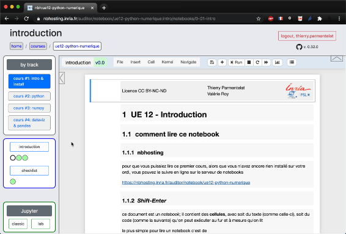
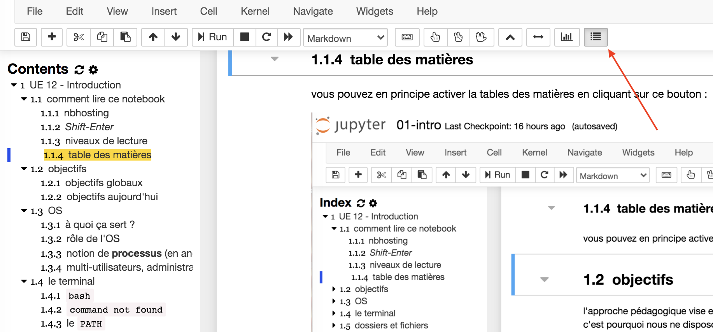

---
jupytext:
  cell_metadata_filter: all,-hidden,-heading_collapsed,-run_control,-trusted
  encoding: '# -*- coding: utf-8 -*-'
  notebook_metadata_filter: all, -jupytext.text_representation.jupytext_version, -jupytext.text_representation.format_version,
    -language_info.version, -language_info.codemirror_mode.version, -language_info.codemirror_mode,
    -language_info.file_extension, -language_info.mimetype, -toc
  text_representation:
    extension: .md
    format_name: myst
kernelspec:
  display_name: Calysto Bash
  language: bash
  name: calysto_bash
language_info:
  help_links:
  - text: MetaKernel Magics
    url: https://metakernel.readthedocs.io/en/latest/source/README.html
  name: bash
nbhosting:
  title: notebooks sur nbhosting
---

Licence CC BY-NC-ND, Thierry Parmentelat & Valérie Roy

```{code-cell}
:tags: [raises-exception]

%%python
from IPython.display import HTML
HTML(filename="_static/style.html")
```

# notebooks sur nbhosting

+++

## comment lire un notebook

+++

pour que vous puissiez lire ce premier cours, alors que vous n'avez encore rien installé sur votre ordi, rendez-vous en ligne sur le serveur de notebooks

<https://nbhosting.inria.fr/auditor/notebook/ue12-p22-intro>

**note**: vous avez reçu par mail les identifiants correspondants

+++



+++

### *Shift-Enter*

+++

ce document est un *notebook*; il contient des **cellules**, avec soit du texte (comme
celle-ci), soit du code (comme la suivante) qu'on peut exécuter au fur et à mesure qu'on
lit

le plus simple pour lire un notebook c'est de

* sélectionner une cellule (avec la souris)
* taper *Maj-Entrée* (ou *Shift-Enter* sur un clavier anglais)  
  ça exécute la cellule courante et ça passe à la suivante; essayez...

```{code-cell}
# ma première cellule de code contient
# un commentaire
# et une commande toute simple
# qui affiche un message

echo "hey there"
```

vous avez dû provoquer l'affichage de `hey there` comme résultat de l'exécution de la cellule juste au dessus de celle-ci;  
continuez la lecture en faisant 'Maj-Entrée'

+++

remarquez que dans ce notebook le code qui s'exécute n'est pas du Python, c'est du bash - le langage du terminal

+++

### table des matières

+++

vous pouvez en principe activer la tables des matières en cliquant sur ce bouton :  
(sinon, voyez la toute dernière section)



+++ {"slideshow": {"slide_type": ""}}

### niveaux de lecture

+++

on a défini plusieurs niveaux de lecture, parfois représentées avec des couleurs

+++ {"tags": ["level_basic"]}

#### basique

+++ {"tags": ["level_intermediate"]}

#### intermédiaire

+++ {"tags": ["level_advanced"]}

#### avancé

+++

pour que les couleurs apparaissent bien (lorsque vous lisez les notebooks en local sur votre ordi), vous devez avoir installé 

```bash
pip install nb-courselevels
```

+++ {"tags": ["framed_cell"]}

#### cadres

parfois aussi les cellules apparaissent avec un cadre comme celle-ci

et de la même façon pour que cela fonctionne il vous avoir installé `nb-courselevels`

+++

***
