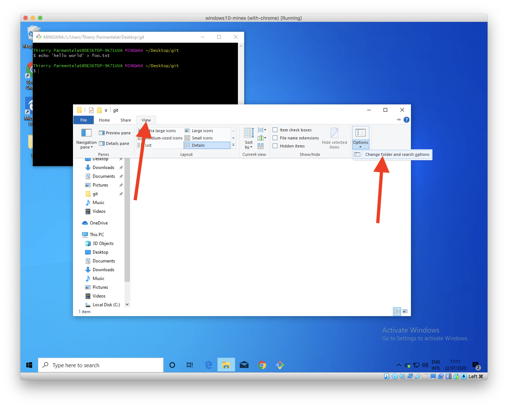
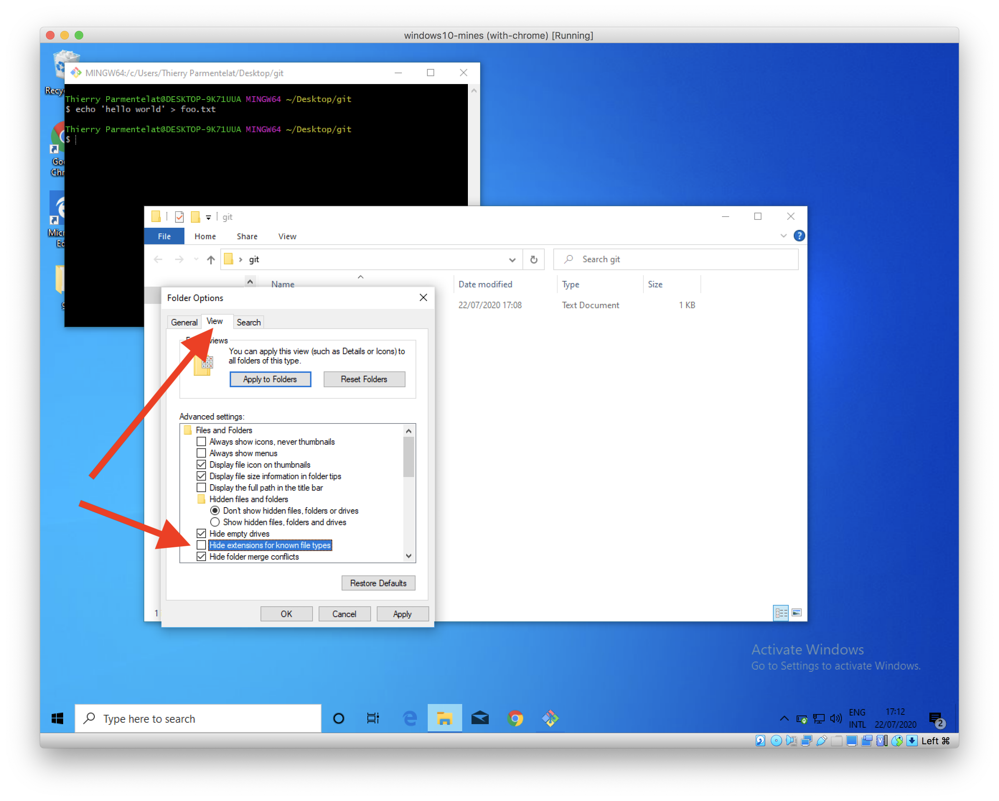

---
jupytext:
  cell_metadata_filter: all,-hidden,-heading_collapsed,-run_control,-trusted
  encoding: '# -*- coding: utf-8 -*-'
  notebook_metadata_filter: all, -jupytext.text_representation.jupytext_version, -jupytext.text_representation.format_version,
    -language_info.version, -language_info.codemirror_mode.version, -language_info.codemirror_mode,
    -language_info.file_extension, -language_info.mimetype, -toc
  text_representation:
    extension: .md
    format_name: myst
kernelspec:
  display_name: Calysto Bash
  language: bash
  name: calysto_bash
language_info:
  help_links:
  - text: MetaKernel Magics
    url: https://metakernel.readthedocs.io/en/latest/source/README.html
  name: bash
nbhosting:
  title: OS & terminal
---

Licence CC BY-NC-ND, Thierry Parmentelat & Valérie Roy

```{code-cell}
:tags: [raises-exception]

%%python
from IPython.display import HTML
HTML(filename="_static/style.html")
```

+++ {"slideshow": {"slide_type": ""}}

# OS & terminal

+++ {"slideshow": {"slide_type": ""}}

* votre OS (Operating System), c'est Windows, MacOS, ou linux
* quelques différences (très) visibles
* mais en réalité de très nombreux concepts communs

+++ {"slideshow": {"slide_type": ""}}

## à quoi ça sert ?

* calculette  
  * un programme a accès à toutes les ressources
  * exemple : je range X dans la case mémoire 1
* ordinateurs
  * plein de programmes **en même temps**
  * accessoirement plein d'utilisateurs

+++ {"slideshow": {"slide_type": ""}}

### rôle de l'OS

* fournir de l'**isolation** entre les programmes
  * si deux programmes différents utilisent la case mémoire 1  
    pour ranger une donnée, ça ne va pas le faire !

* permettre la **concurrence**
  * faire tourner plusieurs programmes en même temps  
    sur un nombre fini de processeurs  

  * lancez sur mac (\*) Activity Monitor   
    typiquement **plusieurs dizaines** de programmes

* fournir de l'**isolation** entre les utilisateurs


(\*) ou alors:  *Task Manager* sous Windows, et *top* sous linux

+++ {"slideshow": {"slide_type": ""}}

### notion de **processus** (en anglais *process*)

* chaque programme qui tourne constitue un ***process***
* les process sont isolés les uns des autres  
  * notamment la mémoire
* l'OS fait tourner tous les programmes  
  * dans un mode ***chacun son tour***
  * à relativement haute fréquence
  * c'est le travail du *scheduler*

+++ {"tags": []}

````{admonition} soyons précis (pour les curieux)
:class: dropdown

le terme *OS* - *Operating System* a plein de significations différentes dans le langage
courant

* Windows et MacOS : incluent une interface graphique
* linux : l'interface graphique est plus clairement séparée, on a le choix

**mais** nous ici lorsqu'on parle d'OS, on désigne **seulement** ce qu'on appelle aussi le
**noyau**

c'est-à-dire techniquement :

* le **seul** programme dans l'ordinateur qui a **accès direct** aux périphériques
* qui "fait tourner" les programmes en leur donnant tour à tour accès au processeur
* et qui fait en sortes qu'ils soient **isolés les uns des autres**
* tous les autres programmes (*user land*) accèdent à ces ressources au travers
  d'**abstractions**

  * mémoire : **mémoire virtuelle**  
    la case mémoire '1' est redirigée vers un bout de mémoire allouée au programme  

  * **système de fichiers**  
    le disque dur est accessible au travers de dossiers et fichiers

  * **interface réseau** etc…
````

+++

### multi-utilisateurs, administrateur

+++

#### historiquement

le modèle d'usage des ordinateurs (très chers) était  
1 ordi = plusieurs (dizaines/centaines d') utilisateurs

ce qui a mis en évidence le rôle de l'**administrateur** (*super-user*)  
qui se chargeait des tâches de maintenance et d'installation

+++

les usages ont beaucoup changé, mais cette dualité (user lambda / admin) est restée  
dans beaucoup d'institutions / compagnies c'est la *DSI* (Direction des Systèmes
d'Information) qui se charge de l'installation de base et de la sécurité

+++

jusque récemment, le modèle mental était que :  
"pour faire une installation, il faut les droits d'administrateur"  
de cette façon on peut faire des économies d'échelle  
(installation = processus compliqué, autant le faire 1 bonne fois pour tous les
utilisateurs)

+++

#### les usages ont changé

+++

* non seulement pour les postes de travail c'est maintenant  
  1 ordi = 1 personne

* mais en plus, la **même personne** peut avoir besoin de **plusieurs environnements** par
  exemple, un développeur peut travailler sur plusieurs projets, un en Python-3.8, un
  autre en Python-3.10, avec des combinaisons de librairies différentes pour chaque projet

+++

si bien que *la notion d'installation unique pour 1 ordi* n'a **que des inconvénients**

* c'est compliqué d'avoir les droits d'administrateur : la DSI y veille, et même sans DSI ça demande des manipulations en plus
* et ça rend très compliqué la mise à disposition de multiples environnements  
  si tout le monde a le même Python, a fortiori un développeur aura toujours le même Python

+++

#### choisir un mode d'installation dans l'espace utilisateur

+++

c'est pourquoi je vous recommande de choisir, lorsque c'est possible, un mode
d'installation **dans l'espace utilisateur** plutôt qu'une installation dans la zone
système

ainsi vos installations seront plus simples, et plus extensibles : vous pourrez plus
facilement jongler entre les environnements lorsque vous serez plus agiles avec tout ceci

pour anticiper un peu, c'est la raison pour laquelle on vous recommandera d'installer
Python avec miniconda (dans la section qui traite de Python)

ça veut dire en pratique que si à un moment de l'installation on vous demande un mot de
passe administrateur, c'est que vous vous êtes fourvoyés et qu'il faut changer d'angle
d'attaque

+++ {"slideshow": {"slide_type": ""}}

## le terminal

+++

le premier outil que nous allons voir c'est ce qu'on appelle le terminal;  
un terminal qu'est-ce que c'est ?

le terminal c'est tout simplement un programme qui permet d'exécuter des commandes

```{code-cell}
:hide_input: false

# la commande la plus basique est `pwd`
# pour afficher le répertoire courant

pwd
```

### `bash`

+++

il y a plein de types de terminal selon les systèmes d'exploitation, mais pour que nous
travaillions tous ensemble sur le même objet, nous allons choisir un terminal qui
s'appelle ``bash``

* `bash` vient avec l'installation de base sur MacOS et linux
* sur Windows, il faut l'installer séparément.  
  nous allons vous guider dans l'installation d'une app qui s'appelle ***git for
  windows*** qui est cool parce qu'elle contient

  * le terminal `bash`, comme ça tout le monde a le même sur tous les OS  
  * et `git`, on va bientôt en parler, bref on fait d'une pierre deux coups

**mais attendez un peu avant de vous précipiter à installer ça !**  

en effet avant de voir cette installation, on va faire une digression sur la façon dont le
terminal recherche ses commandes

+++

### `command not found`

+++

la première difficulté rencontrée par les débutants, c'est ce genre de symptôme  
(rappelez-vous, on exécute les cellules avec *Maj-Entrée*)

```{code-cell}
# j'essaie d'appeler une commande qui n'existe pas 

tutu
```

ce message d'erreur `command not found` - ou `commande introuvable` - vous indique le plus
souvent qu'il y a quelque chose de mal installé

+++

````{note} le PATH (pour les curieux)
:class: dropdown

le `PATH` c'est le mécanisme qui permet au terminal de trouver les commandes

du coup quand on installe un nouveau logiciel, comme on va le faire tout de suite avec
'git for windows', il est parfois nécessaire de modifier le `PATH` pour que les nouvelles
commandes deviennent accessibles depuis le terminal

ce n'est pas crucial de le savoir, mais si vous êtes curieux, sachez que

* `PATH` c'est ce qu'on appelle une variable d'environnement (ça veut dire qu'elle se
  propage d'un processus à l'autre),

* et que c'est une liste de répertoires où sont cherchées les commandes

```bash
# un exemple sur linux/macos
# le ':' est un séparateur
$ echo $PATH
/opt/conda/bin:/usr/local/sbin:/usr/local/bin:/usr/sbin:/usr/bin:/sbin:/bin
```
````

+++

(label-install-git-for-windows)=
### installation de  `bash`

+++

si vous êtes sous linux ou sur MacOs, vous avez déjà `bash` préinstallé

+++

si vous êtes sous Windows : en installant ***git for windows*** on va faire d'une
pierre deux coups, et installer à la fois `bash` et `git`

* allez sur le site là  <https://gitforwindows.org/>, on va vous guider (en vous montrant
  son installation pas à pas)

+++

lancez l'installation...

à la question ***Adjusting your PATH environment*** :  
choisissez au moins l'option recommandée (#2), idéalement l'option #3

+++


+++

### lancez un terminal

+++


+++

### exercice

* installer *git for windows* si vous êtes sur windows
* lancez un terminal
* le cas échéant créez un raccourci pour pouvoir lancer un terminal rapidement
* tapez les commandes suivantes :


+++

## dossiers et fichiers

+++

le contenu du disque dur est organisé en **dossiers** et **fichiers**

le **dossier** est juste un cas particulier de fichier  

* qui **contient d'autres fichiers** (ou dossiers, donc)  
* au lieu de contenir des données

termes synonymes :

* dossier, répertoire, *folder*, *directory*: c'est tout pareil
* fichier, *file*: idem ce sont des synonymes

+++

### répertoire courant

+++

tous les programmes (processus) ont ce qu'on appelle un répertoire courant

dans le terminal on peut le voir avec la commande `pwd`  
(*print working directory*)

```{code-cell}
# petite digression, ici je suis dans un notebook 'bash'
# et je peux exécuter des commandes comme dans un terminal
pwd
```

#### à quoi ça sert

c'est uniquement une **commodité** pour ne pas avoir à retaper le chemin complet depuis la
racine des dossiers

je m'explique :

```{code-cell}
# on crée un fichier bidon

echo "Hello world" > foo.txt
```

```{code-cell}
# avec la commande `ls`
# on peut voir la liste des fichiers
# et donc ici on va voir entre autres
# le fichier 'foo.txt' qu'on vient de créer

ls
```

```{code-cell}
# on peut vérifier que le fichier 'foo.txt' existe bien

ls foo.txt
```

```{code-cell}
# ou avoir plus de détails sur ce fichier
# sa taille, sa date

ls -l foo.txt
```

reprenons; une autre commande utile c'est `cat`; ça permet tout simplement de voir le
contenu d'un fichier

```{code-cell}
# le point important c'est que je peux faire référence
# à ce fichier sous le nom simplement 'foo.txt'

cat foo.txt
```

```{code-cell}
# et comme je suis dans le répertoire
# /home/jovyan/work/notebooks

pwd
```

```{code-cell}
# je pourrais faire aussi
# (à modifier éventuellement selon votre environnement)

cat /home/jovyan/work/notebooks/foo.txt
```

et donc pour moi, parce que je suis dans le répertoire
`/home/jovyan/work/notebooks/`

c'est pareil de faire

```console
cat /home/jovyan/work/notebooks/foo.txt
```

ou tout simplement

```
cat foo.txt
```

+++

### chemins relatifs

+++ {"tags": []}

ce serait aussi équivalent de faire

```console
cat ./foo.txt
```

car le répertoire `.` désigne justement le répertoire courant

+++

par convention:

* `.` désigne le répertoire courant
* `..` désigne le répertoire "au dessus" du répertoire courant  
  on l'utilise pour fabriquer des chemins du genre de

      cat ../frere/neveu

+++

pour "remonter" dans l'arborescence des dossiers, je peux donc utiliser un chemin relatif

```{code-cell}
pwd
```

```{code-cell}
# `cd` ça veut dire *change directory* 

cd ..
```

```{code-cell}
pwd
```

enfin, une astuce utile c'est pour **revenir en arrière** avec `cd -`

```{code-cell}
# du coup là je me retrouve à mon point de départ
cd -
```

```{code-cell}
# pour créer un répertoire je peux utiliser mkdir
# attention toutefois car on ne peut pas le faire 
# s'il existe déjà

mkdir new-folder
cd new-folder
pwd
```

```{code-cell}
# qui bien sûr est vide 

ls 
```

```{code-cell}
# et pour revenir à mon point de départ
# je pourrais faire comme tout à l'heure
# cd - 
# ou encore, puisque je sais que c'est juste un cran au dessus

cd ..
pwd
```

### répertoire utilisateur (*home directory*)

+++

enfin chaque utilisateur possède un répertoire,  
qui est la racine de l'arbre dans lequel il peut ranger ses affaires  
indépendamment du système d'exploitation

pour y aller le plus simple est de faire simplement `cd` sans paramètre

```{code-cell}
# sans paramètre je retourne tout en haut de mon espace
cd
```

```{code-cell}
# c'est mon home-directory
pwd
```

```{code-cell}
# et je peux redescendre là d'où je venais
cd -
pwd
```

## organisation en dossiers: quelques conseils

+++

quelques conseils pour organiser votre travail en dossiers

+++

### choisissez-vous un "dossier principal"

le *homedir*, c'est une racine tentante pour mettre ses affaires, mais souvent il y a pas
mal de fourbis dès le départ; sur Windows par exemple si vous regardez son contenu
(faites-le !), vous verrez que c'est pas mal encombré

du coup je vous conseille de vous choisir un dossier principal, pas trop profond par
rapport à votre *homedir*, mais qui est vide au démarrage

un choix pas absurde, sur toutes les platesformes, c'est de prendre comme dossier
principal  
`~/Desktop/git`  (dans bash, `~` représente le *homedir*)  
l'avantage de choisir un dossier directement sous `~/Desktop/` est qu'on le voit
apparaitre sur le bureau

et en dessous de ce dossier principal vous allez ranger vos différents dossiers

+++

### ne pas abuser sur la profondeur des arbres  

évitez de couper les cheveux en 4 en créant plein de sous-répertoires, genre :

~~`/User/jeanmineur/Desktop/git/mines/première-année/info/ue12/numerique`~~

au contraire :

* si vous créez un dossier par sujet avec un nom explicite
  * par exemple ce cours pourrait s'appeler `ue12-p23-numerique`
* et que vous regroupez tous ces dossiers dans **un seul répertoire**,
* ça peut largement suffire

du coup créez plutôt un dossier  
`/User/jeanmineur/Desktop/git/ue12-p23-numerique`

+++

### noms de fichiers

c'est assez facile (avec l'explorateur de fichiers notamment) de créer des fichiers dont
le nom contient des caractères biscornus, comme des espaces ou des accents

mais après ça devient rapidement compliqué de les utiliser, dans le terminal notamment

c'est pourquoi on recommande d'**éviter les espaces et les accents** dans les noms de
fichiers

+++

### créez des raccourcis

pour pouvoir facilement accéder à vos fichiers, investissez un peu de temps pour trouver
comment on peut créer des raccourcis depuis l'explorateur de fichiers

+++

sur le screenshot suivant, on a choisi

* de créer un dossier `git` directement dans le Desktop
* pour l'instant il est vide, mais c'est là qu'on va ranger tous les dossiers de premier
  niveau

* comme il est créé dans le dossier `Desktop`, on voit ce dossier `git` directement sur le
  bureau

* et pour faire bon poids on a même créé un raccourci dans l'explorateur de fichiers
* tout ça pour pouvoir y accéder rapidement en toute circonstance
* remarquez aussi le menu contextuel; on peut facilement créer un `git bash` qui démarrera
  directement dans ce dossier (`git` sera son répertoire courant)

+++

*pour créer un raccourci dans l'explorateur Windows*


+++

*une fois bien installé on peut rapidement accéder à notre dossier principal de plein de
façons*


+++ {"tags": ["level_intermediate"]}

### affichez les extensions dans les noms de fichier

dans l'explorateur Windows par défaut, si vous créez un fichier `foo.txt` on va vous
montrer dans l'explorateur de fichiers une entrée qui s'affiche avec simplement `foo`

par défaut, on a jugé que c'était "plus simple" de ne pas montrer l'extension, ici `.txt`  
personnellement je ne trouve pas ça très pratique…

voici comment on peut changer ce comportement, pour voir les noms de fichier en entier,
i.e. comme avec le terminal





+++

## quelques commandes `bash` utiles

+++

### commandes utiles

+++

voici pour résumer un rappel des commandes bash les plus simples et les plus utiles

| commande | fonction |
|-:|:-|
| `cd` | changer de dossier courant |
| `pwd` | afficher le dossier courant |
| `ls` | lister les fichiers et dossiers dans le dossier courant |
| `mkdir` | créer un dossier |
| `rm` | supprimer des fichiers - **attention** ils sont supprimés pour de bon et non pas placés dans la corbeillle |
| `echo un message` | pour afficher du texte |
| `cat unfichier` | pour afficher le contenu d'un (ou plusieurs) fichier |

+++

### redirections

+++

plutôt que d'afficher la résultat d'une commande dans le terminal, il est parfois pratique de rediriger cela dans un fichier

par exemple si j'écris dans le terminal

```{code-cell}
# je crée ou j'écrase le fichier foo.txt
echo "un petit fichier bidon" > foo.txt
```

ce qui va se passer c'est que je vais créer (ou écraser) le fichier `foo.txt` pour y ranger dedans la chaine  
`un petit fichier bidon\n`

le dernier cararactère (`\n`) correspond à un **saut de ligne**

+++

### *globbing*

+++

si j'ai plusieurs fichiers qui se terminent en `.txt`, je peux les lister avec la notation en `*` comme ceci

```{code-cell}
# je crée (ou j'écrase) un second fichier bar.txt
echo "un autre fichier bidon" > bar.txt
```

```{code-cell}
# de là je peux lister tous les fichiers qui se terminent en .txt

ls *.txt
```

```{code-cell}
# ou tous ceux qui commencent par un f

ls f*
```

```{code-cell}
# ou toute combinaison du même genre

ls f*txt
```

#### à n'importe quelle profondeur

```{code-cell}
# si je veux chercher tous les fichiers en *.txt
# à n'importe quelle profondeur sous mon dossier courant

ls **/*.txt
```

+++ {"tags": ["level_intermediate"]}

#### les crochets `[]`

```{code-cell}
:tags: [level_intermediate]

# on peut aussi utiliser les [] 
# ici tous les fichiers qui commencent par un f ou un b et qui finissent en .txt

ls [fb]*.txt
```

***
