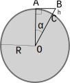

---
jupytext:
  cell_metadata_filter: all,-hidden,-heading_collapsed,-run_control,-trusted
  encoding: '# -*- coding: utf-8 -*-'
  notebook_metadata_filter: all, -jupytext.text_representation.jupytext_version, -jupytext.text_representation.format_version,
    -language_info.version, -language_info.codemirror_mode.version, -language_info.codemirror_mode,
    -language_info.file_extension, -language_info.mimetype, -toc
  text_representation:
    extension: .md
    format_name: myst
kernelspec:
  display_name: Python 3 (ipykernel)
  language: python
  name: python3
language_info:
  name: python
  nbconvert_exporter: python
  pygments_lexer: ipython3
nbhosting:
  title: checklist
---

Licence CC BY-NC-ND, Thierry Parmentelat & Valérie Roy

```{code-cell} ipython3
%%python
from IPython.display import HTML
HTML(filename="_static/style.html")
```

# checklist

un résumé des compétences attendues pour commencer les cours d'info

+++

## vidéo

+++

voici une vidéo assez courte qui vous montre le minimum de choses que vous devriez pouvoir faire sur votre ordi, afin de vérifier que vous avez bien tout installé:

<https://youtu.be/i_ZcP7iNw-U>

+++

## les compétences

+++

voici maintenant une liste un peu plus complète des compétences qui sont attendues de votre part:

+++

### terminal

* lancer un terminal (bash ou git bash)
* trouver votre répertoire courant, changer de répertoire courant
* voir la liste des fichiers
* afficher le contenu d'un fichier texte
* fermer le terminal

+++

### organisation en dossiers

* se choisir une façon de ranger les dossiers sous un dossier principal
* savoir rapidement ouvrir un explorateur sur le dossier principal
* savoir ouvrir rapidement un terminal dans le dossier principal

+++

### éditeur de code *vs-code*

* après avoir installé l'éditeur vscode, savoir :
* le lancer rapidement dans le dossier principal
  * à partir de l'explorateur de fichiers
  * à partir du terminal
* afficher / cacher l'explorateur de fichiers
* couper l'écran en 2 pour travailler sur deux fichiers en même temps
  * verticalement et horizontalement
  * revenir à une vue unique
* avoir installé l'extension pour Python
  * n'hésitez pas à essayer d'autres extensions

+++

### Python / pip

* avoir installé un environnement Python
* afficher le numéro de version de Python
* lancer un micro-programme (genre hello-world ou factoriel) depuis le terminal
* lancer `ipython` pour faire du Python en mode interactif
* savoir utiliser la complétion (par exemple `import frac` donne `import fractions`)
* sortir de `ipython`
* avoir installé `numpy`, `pandas` et `matplotlib`
* trouver le numéro de version de ces 3 librairies

+++

### git

* avoir installé `git`; savoir :
* cloner un dépôt trouvé sur github
* créer un compte sous <https://github.com/join>
* mettre à jour un dépôt cloné, après que son auteur a publié des modifications

+++

### Jupyter

* avoir installé jupyter
* avoir installé jupytext
* lancer `jupyter notebook`; savoir :
* créer un nouveau notebook
* ajouter des cellules, alterner entre code et markdown
* sauver un notebook
* ouvrir un notebook existant
* insérer une équation mathématique simple

+++

### notebooks du cours

idéalement à la fin de cette leçon vous devriez être capable

* de cloner les supports de cours qui sont ici  
  <https://github.com/ue12-p22-intro>

* d'ouvrir sous jupyter le notebook principal `notebooks/0-10-demonstration.md`
* de le modifier, ajouter de nouvelles cellules, le sauver, ...
* en option, regarder les différences entre votre dépôt et le cours d'origine avec `git
  status` et `git diff`

+++ {"tags": ["level_intermediate"]}

### Python sous vs-code

sous vs-code, savoir :

* trouver les erreurs signalées par l'éditeur (les zigouigouis)
* trouver la raison de l'erreur (passer la souris dessus)
* ouvrir / fermer la fenêtre de listing du détail des erreurs

notez que cela suppose d'avoir :

* configuré l'interpréteur Python pour vs-code
* installé pylint

+++

## exercices optionnels

ceux qui sont très en avance peuvent

1. d'abord, aider leurs camarades
1. et ensuite, traiter un des exercices suivants :

+++

### exo 1 (assez libre)

* créer un notebook (Python, pas bash)
* dans lequel vous traitez, une peu comme le fait le notebook de démonstration, un tout
  petit sujet de maths, avec comme objectif d'écrire a minima

  * du markdown un peu structuré
  * des équations simples qui parlent du problème ou de la méthode
  * un petit bout de code, qui implémente une solution au problème

suggestions de sujets possibles:

* fibonacci
* factoriel
* combinaisons n parmi p
* calcul du pgcd

+++

### exo 2 (plus dirigé)

+++

même consigne, pour le calcul de la visibilité à une altitude donnée :

vous êtes sur le globe terrestre au point $B$, à une altitude $h$, vous devez
calculer la distance à laquelle se situe l'horizon (on admet que c'est la mer tout autour
de vous)

c'est-à-dire que vous devez calculer, à partir de $h$, la distance AB

et réciproquement, étant donné AB, vous devez calculer à quelle hauteur il faut se hisser
pour apercevoir un objet à cette distance



applications :

* je suis en mer à 50 nautiques ($\alpha$ = 50') de la Corse, à quelle altitude sont les
  montagnes qui m'apparaissent au niveau de l'horizon ?

* à quelle altitude est-ce que dois monter pour voir un point qui flotte à 10 nautiques de
  moi ?

**rappels**

* la circonférence du globe mesure 40.000 km
* une mile nautique = 1' de latitude

```{code-cell} ipython3
# la longueur d'un mile nautique en km, du coup
10_000 / (60 * 90)
```
